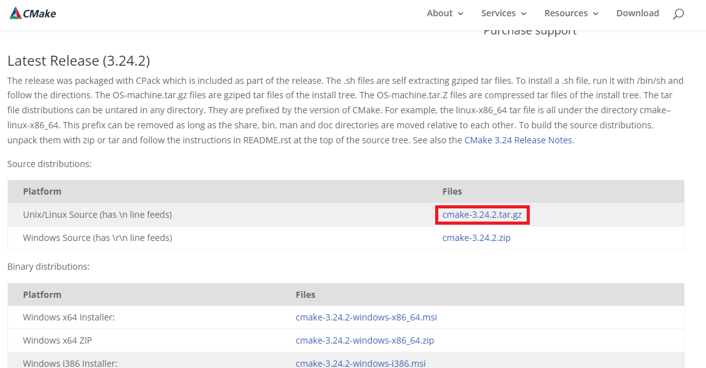
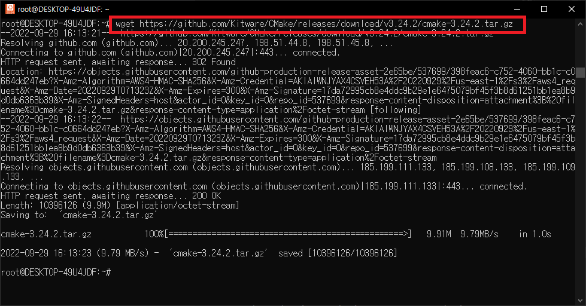
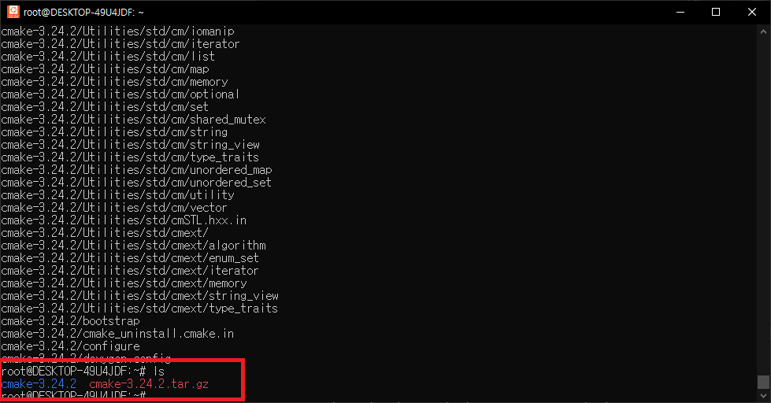
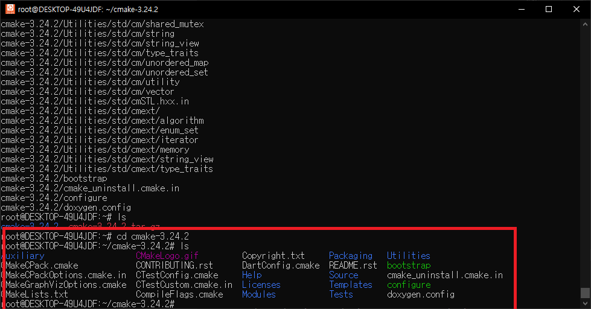
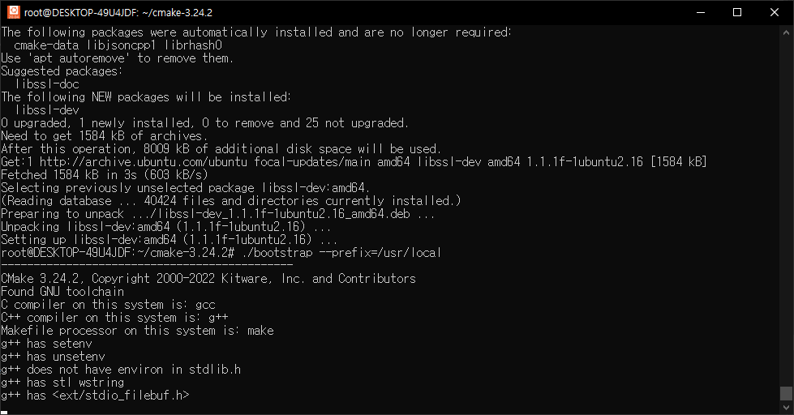
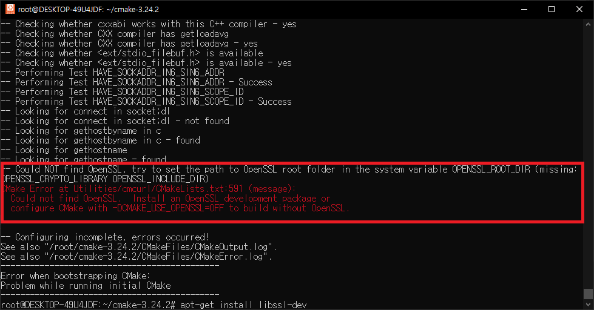
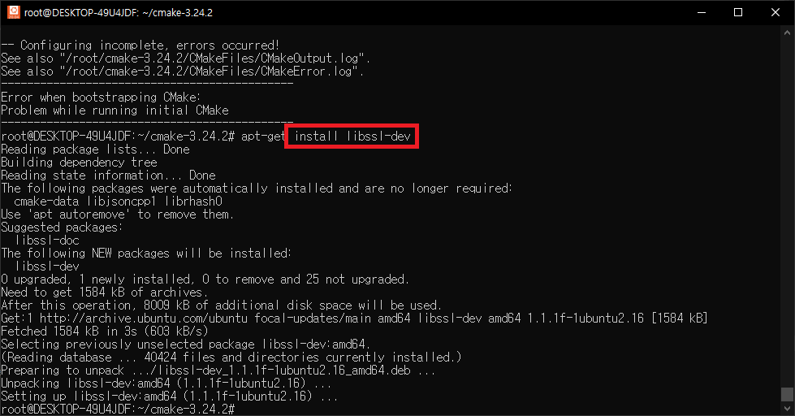
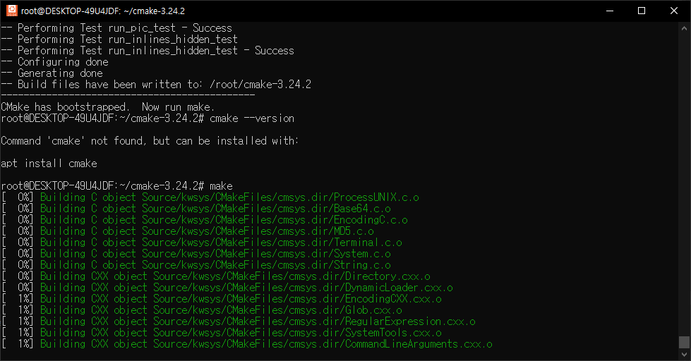
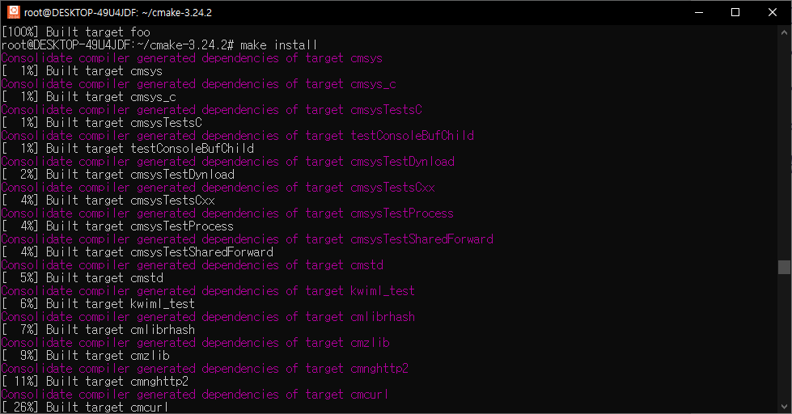
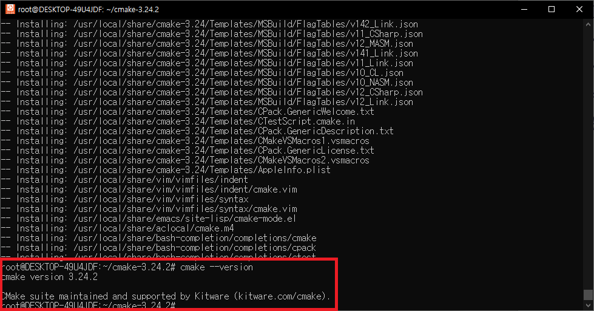

+++
author = "IceBlueHalls"
title = "우분투에 최신버전 Cmake 다운받기"
date = 2022-10-04T02:35:04+09:00
description = "CMake가 3.19 버전까지만 다운받아지는 우분투 환경에서 3.24 CMake를 다운받는 법"
tags = [
    "C++",
    "Linux"
]
categories = [
    "C++",
    "Linux"
]
series = ["CMake"]
aliases = ["CMake"]
image = "bootstrap_success.PNG"
slug = "how-to-download-cmake-in-ubuntu"
+++


우분투의 경우, 명령어로 cmake를 다운받으면 3.19가 다운 받아지며 그 이상의 버전은 다운이 불가능하다.  

따라서 cmake 최신 버전을 다운받으려면 다음과 같이 알집 파일을 압축 해제해서 안에 있는 실행파일을 직접 실행시켜야 한다.

## Cmake 홈페이지에 접속

링크 : https://cmake.org/download/

## 리눅스용 설치 파일의 링크를 복사


## 우분투를 열어 다운받기 명령어 실행


```
wget https://github.com/Kitware/CMake/releases/download/v3.24.2/cmake-3.24.2.tar.gz
```

## 다운받은 압축파일 압축 풀기

```
tar -xvzf 해당파일.tar.gz
```




압축이 풀리면 tar.gz 말고 일반 cmake-3.24.2가 보일 것이다.


## 해당 폴더로 접속하여 bootstrap 실행

```
cd cmake-3.24.2
```




```
./bootstrap --prefix=/usr/local
```



### c++ 미설치 에러

```
root@DESKTOP-49U4JDF:~/cmake-3.24.2# ls
Auxiliary                   CMakeLogo.gif         DartConfig.cmake  Source                    configure
Bootstrap.cmk               CONTRIBUTING.rst      Help              Templates                 doxygen.config
CMakeCPack.cmake            CTestConfig.cmake     Licenses          Tests
CMakeCPackOptions.cmake.in  CTestCustom.cmake.in  Modules           Utilities
CMakeGraphVizOptions.cmake  CompileFlags.cmake    Packaging         bootstrap
CMakeLists.txt              Copyright.txt         README.rst        cmake_uninstall.cmake.in
root@DESKTOP-49U4JDF:~/cmake-3.24.2# sudo sh bootstrap
---------------------------------------------
CMake 3.24.2, Copyright 2000-2022 Kitware, Inc. and Contributors
C compiler on this system is: cc
---------------------------------------------
Error when bootstrapping CMake:
Cannot find a C++ compiler that supports both C++11 and the specified C++ flags.
Please specify one using environment variable CXX.
The C++ flags are "".
They can be changed using the environment variable CXXFLAGS.
See cmake_bootstrap.log for compilers attempted.
```

위와 같은 에러가 뜰 경우, 아래 명령어를 통해 g++을 다운받아야한다.(아래 openssl과 함께 참조)

```
apt-get install g++
```

### openssl 미설치 에러

```
Could NOT find OpenSSL, try to set the path to OpenSSL root folder in the system variable OPENSSL_ROOT_DIR
```




아래 명령어를 통해 openssl을 다운받아야한다

```
apt-get install libssl-dev
```



## make & make install 명령어로 cmake를 설치한다

```
make
```



```
make install
```




## 설치 완료. 버전 확인
정상적으로 3.24.2가 출력되면 성공한 것이다.

```
cmake --version
```

