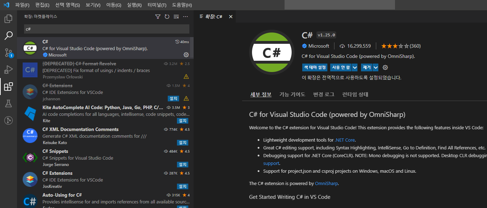
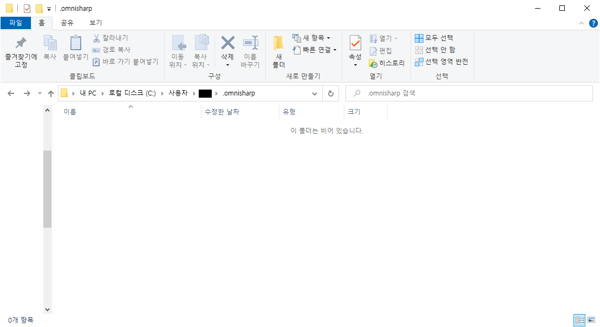
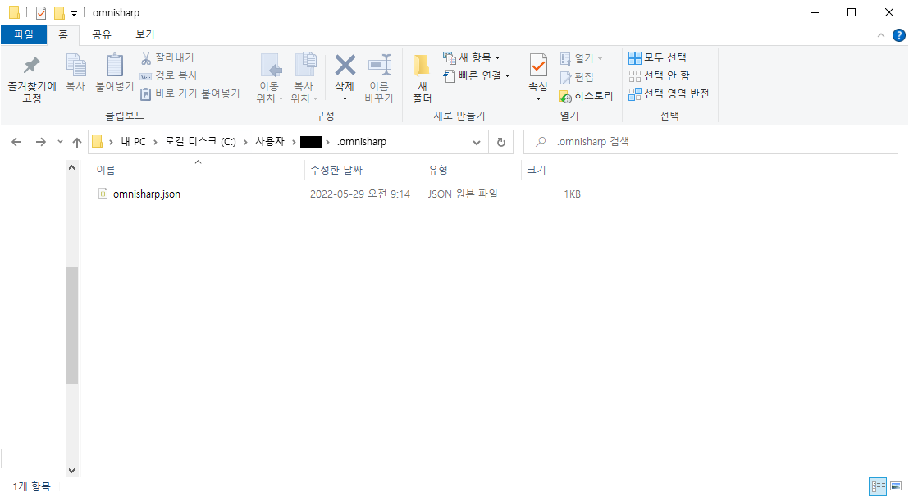
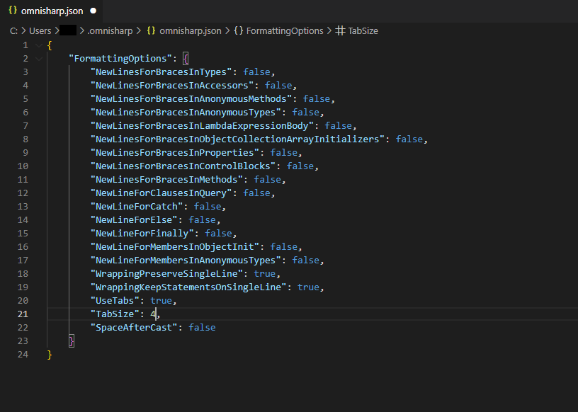
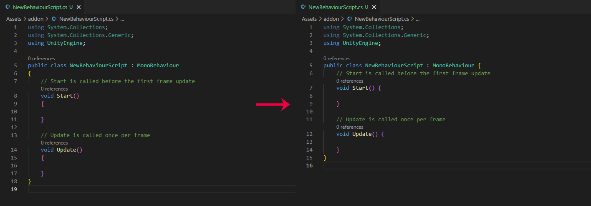

+++
author = "IceBlueHalls"
title = "VSCode에서 중괄호 스타일 K&R로 변경하기"
date = "2022-09-28"
description = "VSCode에서 C#의 중괄호 스타일을 BSD에서 K&R로 바꾸는 방법을 알아보고자 한다."
tags = [
    "VSCode",
    "CSharp"
]
categories = [
    "VSCode",
    "CSharp",
]
series = ["KnR"]
aliases = ["KnR"]
image = "before_after.png"
slug = "how-to-change-knr-style"
+++

## 개요

현재 사용중인 코딩 스타일은 BSD로 다음과 같다.

**BSD**
```
int main() 
{

}
```

문득 이쁘지 않은 거 같아 K&R 스타일로 바꿔보려고 한다.

**K&R**
```
int main() {

}
```

Visual Studio는 쉽게 기능을 제공해주는데, VSCode는 설정에서 지원하지 않아 커스텀 설정을 해주어야 한다.


## 1 .C# 확장 설치
VSCode 왼쪽 확장 탭 버튼을 통해 확장 탭으로 가고 C#을 검색하여 Microsoft에서 공식 지원하는 확장(extension)을 다운받는다.



## 2. .omnisharp 폴더 찾기
확장의 설치가 다되었으면 내 컴퓨터 어딘가에 설정값을 저장하는 폴더가 생긴다.
아마 대부분은 내 PC > 로컬 디스크 C > 사용자 > {사용자 이름} > .omnisharp 폴더로 생길 것이다.


앞으로 여기에 있는 설정값에 따라 c# 문법은 해당 설정값에 따라 포맷팅이 될 것이다.

## 3. omnisharp.json 파일 새로 생성
설정값을 적용하기 위해서는 .omnisharp 폴더에 omnisharp.json이라는 json 파일을 만들어야한다.
이름이 틀리면 작동하지 않는다.




## 4. omnisharp.json 작성
생성했으면 안에 값을 다음과 같이 입력한다.

```
{
    "FormattingOptions": {
      "NewLinesForBracesInTypes": false,
      "NewLinesForBracesInAccessors": false,
      "NewLinesForBracesInAnonymousMethods": false,
      "NewLinesForBracesInAnonymousTypes": false,
      "NewLinesForBracesInLambdaExpressionBody": false,
      "NewLinesForBracesInObjectCollectionArrayInitializers": false,
      "NewLinesForBracesInProperties": false,
      "NewLinesForBracesInControlBlocks": false,
      "NewLinesForBracesInMethods": false,
      "NewLineForClausesInQuery": false,
      "NewLineForCatch": false,
      "NewLineForElse": false,
      "NewLineForFinally": false,
      "NewLineForMembersInObjectInit": false,
      "NewLineForMembersInAnonymousTypes": false,
      "WrappingPreserveSingleLine": true,
      "WrappingKeepStatementsOnSingleLine": true,
      "UseTabs": true,
      "TabSize": 4,
      "SpaceAfterCast": false
    }
}
```



### 설정값
여기서 영어를 할 수 있는 분들이라면 커스텀마이징이 가능해진다.
위 설정값을 true/false로 변경하는 것으로 쉽게 수정이 가능하며, 위에 기재된 설정값 외에도 더 많은 값들이 존재한다.

위 값 또한 스택오버플로우에서 유저들이 사용하는 것을 그대로 가져온 것이기 때문에 기본이 되는 규약은 아니다.
거기서 추가한 것은 Catch, Finally문에서도 K&R이 적용되도록 NewLineForCatch와 NewLineForFinally를 false로 한 설정 뿐이다.

## 5. 완료
이것으로 기본 포맷팅은 완료가 되었다.

한번 VSCode를 껏다 키고 포맷팅이 원하는대로 되는지 확인하자.
Alt + Shift + F 시 현재 페이지를 포맷팅 할 수 있다.(Ctrl + Shift + F는 검색이므로 혼동하지 말자)


## 그 외
처음에는 적용이 안되고 포맷팅이 아예 안되는 현상이 있었다.
이 경우 C# 확장을 최신 버전이 아닌 1~2단계 아래 버전으로 바꾸었더니 확장이 새로 설치되면서 적용이 되었다.
