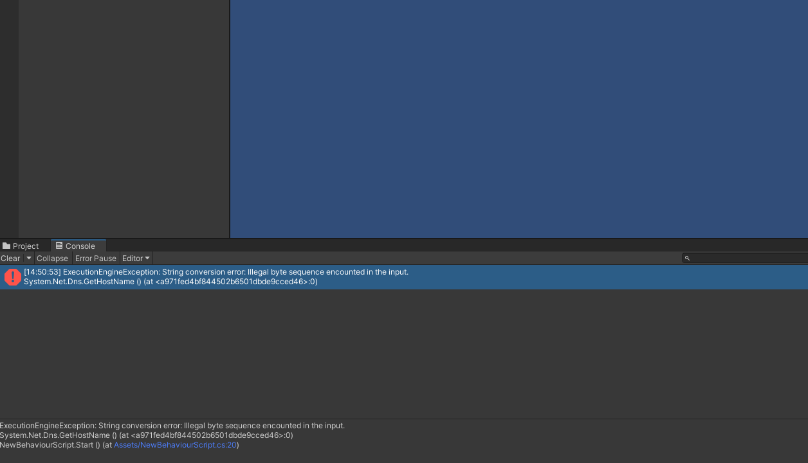

+++
author = "IceBlueHalls"
title = "HttpRequestMessage 사용 시, illegal byte sequence encounted in the input. 에러 발생"
date = "2023-01-09"
description = "HttpRequestMessage 사용 시, illegal byte sequence encounted in the input 에러가 왜 발생하는지에 대해 알아보려고 한다."
tags = [
    "CSharp",
    "Unity"
]
categories = [
    "CSharp",
    "Unity"
]
series = ["HttpRequestMessage"]
aliases = ["HttpRequestMessage"]
image = "unity-error.png"
slug = "http-request-message-error1"
+++

## 에러 발생

유니티에서 HttpRequest 통신을 구현하였다.

```js
Illegal byte sequence encounted in the input.
```

하지만 호출 시, 다음과 같은 에러가 발생하게 된다.

열심히 검색해본 결과, 대부분의 답변은 프로젝트에 사용되는 경로중에 한글이 있어서 발생한다는 답변이었다.

## 프로젝트 경로에 한글?

근데 관련 경로를 찾아보아도 한글은 존재하지 않았다.


사용자 이름도 영어로 되어있어서 해당 문제는 아니였고, 검색해본 결과 HttpRequest중에 호스트 이름을 사용하는 것을 알게 되었다.

## GetHostName으로 테스트

관련된 함수중 로컬 호스트 이름=기기명을 불러오는 함수를 알게 되었고 다른 사람들은 잘 안되는데 내 컴퓨터만 계속해서 에러가 발생중.

```js
using UnityEngine;

public class NewBehaviourScript : MonoBehaviour
{
    void Start() {
        Debug.Log(System.Net.Dns.GetHostName());
    }
}
```



```csharp
ExecutionEngineException: String conversion error: Illegal byte sequence encounted in the input.
```

## 정답은 기기 이름!

기기를 확인해보니 ‘내PC’라는 한글이 포함된 이름을 사용하고 있었고…


영어로 바꾸고,


DNS.GetHostName을 실행했더니


잘실행되었다.

어쨋든 한글이 있으면 해당 에러가 발생하는 것을 알게되었다.

## 추가

유니티 경로중에 Program Files등의 띄어쓰기가 있는 경로나 한글이 들어가 있음에도 에러는 발생하지 않았다.