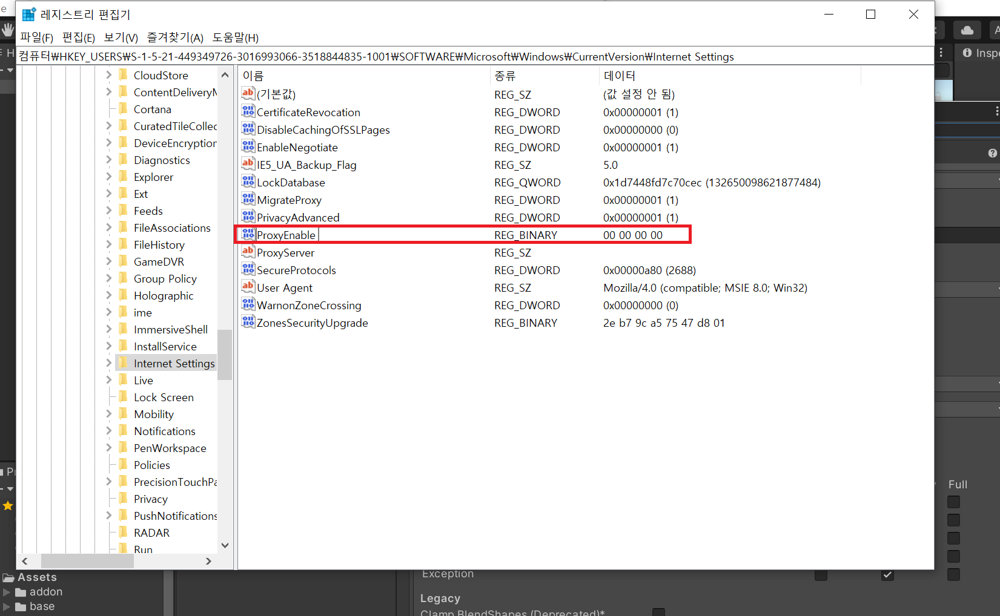
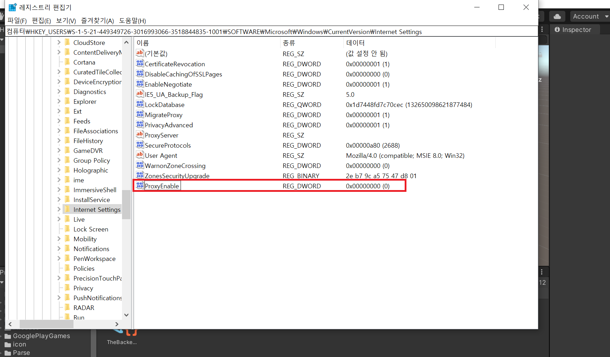

+++
author = "IceBlueHalls"
title = "HttpRequestMessage 사용 시, Specfied cast is not valid 에러 발생"
date = "2023-01-23"
description = "HttpRequestMessage 사용 시, Specfied cast is not valid 에러가 왜 발생하는지에 대해 알아보려고 한다."
tags = [
    "CSharp",
    "Unity"
]
categories = [
    "CSharp",
    "Unity"
]
series = ["HttpRequestMessage"]
aliases = ["HttpRequestMessage"]
image = "success.png"
slug = "http-request-message-error2"
+++

## 에러 발생

유니티에서 HttpRequest 통신을 구현하였다.
이전 컴퓨터에서는 잘 돌아갔지만 새로운 컴퓨터에서 시도해 보니 다음과 같은 에러가 발생하였다.

### 테스트 코드
```csharp
using UnityEngine;

public class NewBehaviourScript : MonoBehaviour
{
    void Start() {
        Debug.Log(System.Net.Dns.GetHostName());
    }
}
```

### 실행 시 에러
```js
Specfied cast is not valid
```

열심히 찾아본 결과, 데이터 전송 시에 규격이 맞지 않다는 에러가 대부분이었고, 내가 파싱 방식을 지정하는 것도 아닌데다 다른 컴퓨터에서는 잘만 실행되는지라 이상하여 코드 문제보다는 설정 문제로 추측하였다.

## 정답은 Proxy 레지스트리 잘못!

해결 방법은 [해당 블로그](https://blog.naver.com/jelly753f/222127953518)를 참조하였다.

다른 컴퓨터에서는 잘 실행되던 문제인지라 로컬 설정값중 에러가 있을 것으로 추측하였고, 그중 제일 신빙성이 있어보이는 것이 서버와 연결하는 프록시 관련 설정이 이상할 것이라고 추측하였다.

확인해본 결과 ProxyEnable이 REG_DWORD로 되어있어야 하지만 REG_BINARY로 되어있었다.



해당 레지스트리를 삭제하고 동일한 이름의 REG_DWORD로 생성하였더니 잘 실행되었다.

