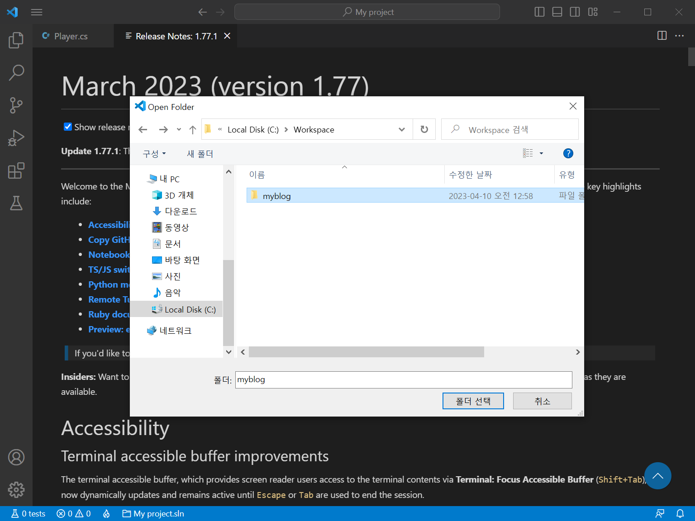
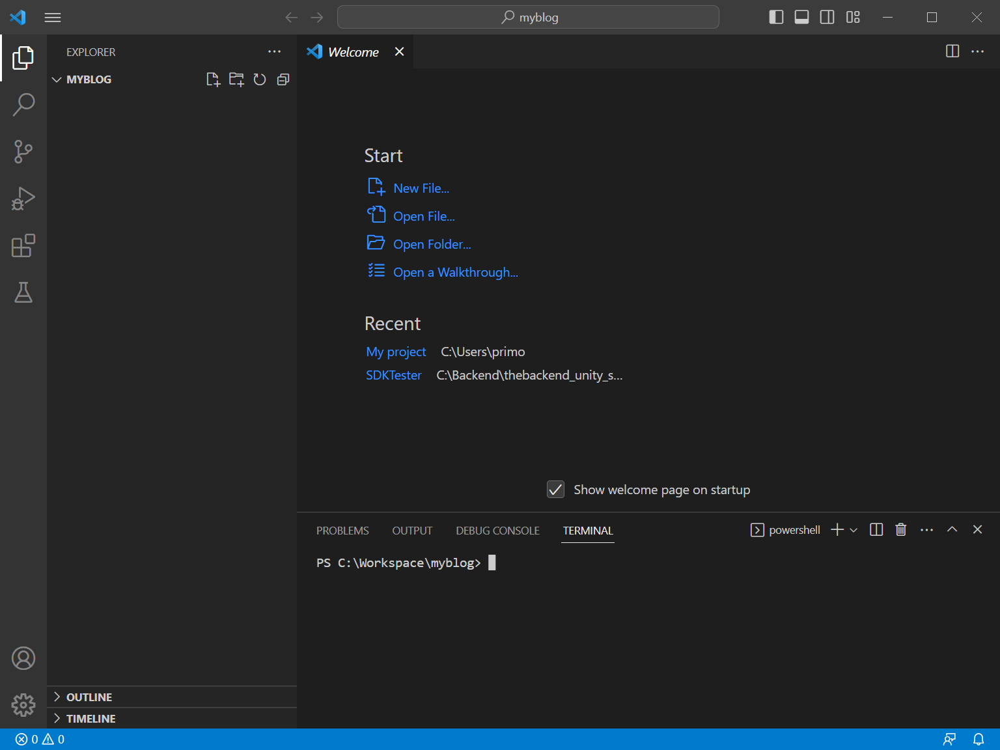
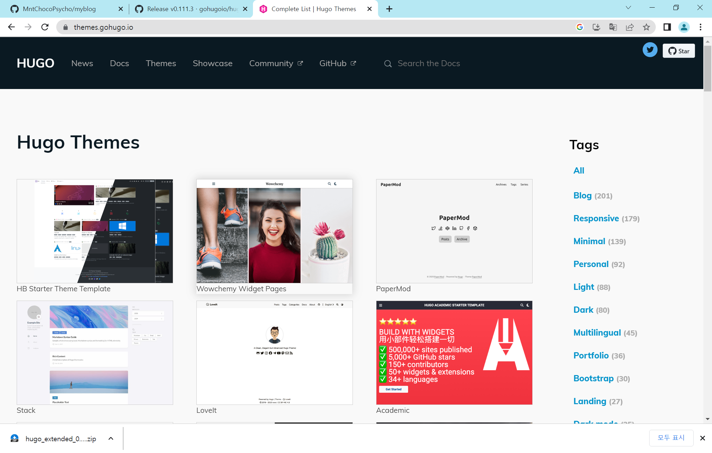
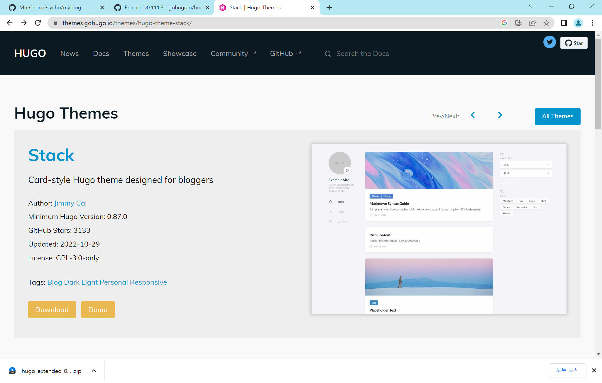
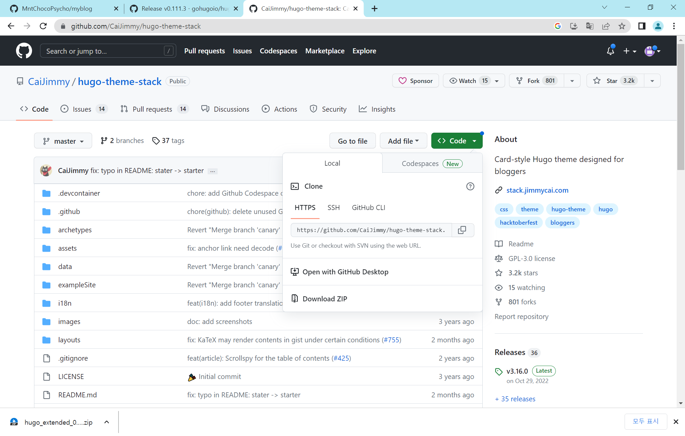

+++
author = "IceBlueHalls"
title = "따라하기 제일 쉬운 Hugo로 블로그 만들기 #2"
date = "2023-04-14"
description = "hugo로 블로그 만들기 2편"
tags = [
    "Hugo"
]
categories = [
    "Hugo"
]
series = ["Hugo"]
aliases = ["Hugo"]
image = "1.PNG"
slug = "etc/hugo/install2"
+++

## VSCode로 콘텐츠 블로그 저장소 열기
VSCode로 컴퓨터에 다운로드한 콘텐츠용 블로그 저장소를 엽니다.

이전 포스팅에서는 myBlog로 설정된 폴더입니다.




VSCode로 열 경우에는 VSCode 하단의 Terminal에서 해당 폴더에서부터 명령을 시작하도록 설정됩니다.

VSCode의 Terminal은 cmd로 가서 cd C:\Workspace\myBlog 를 호출한 것과 동일한 결과입니다.

## hugo 명령어로 블로그 생성


## Hugo 테마 다운로드
블로그의 꽃, 테마를 다운받아보겠습니다.

[휴고 테마 공식 모음 사이트](https://themes.gohugo.io/)에 접속합니다.



해당 예제에서는 Stack이라는 테마를 다운받았습니다.
이외의 테마를 다운받는 것도 가능하지만 해당 블로그의 포스팅에서는 Stack을 기준으로 하였기 때문에 설정값이 달라 이후 진행이 힘드실 수 있습니다.

만약 처음 Hugo 블로그를 이용하신다면 먼저 Stack 테마로 테스트하시고 적응이 되시면 다른 테마로 변경하는 것을 추천드립니다.




Stack을 클릭하고 Download를 클릭합니다.



Download를 클릭하면 github로 이동이 되는데 해당 git을 클론하도록 주소를 복사합니다.


다시 VSCode로 돌아와 아래 Terminal에서 명령어 `hugo site blog`를 입력합니다.

hugo가 성공적으로 설치되었다면 아래 영어가 주르륵 뜨면서 폴더 생성이 완료됩니다.


해당 폴더 안에 hugo 명령어로 만든 blog가 생성되었는데 사실 생성된 blog의 위치는 한번 앞으로 와야합니다.


만들어진 blog의 모든 파일들을 blog 밖으로(.git 파일이 있는 곳) 이동합니다.


다 옮기면 blog는 빈폴더가 되는데 그냥 삭제해줍니다.


깃허브 폴더로 전부 이동이 완료되었다면 이제는 휴고 블로그의 테마를 설치해볼 예정입니다.

다음 명령어로 내블로그에 서브모듈로 테마 블로그를 설치합니다.

git submodle add {git 주소} themes/{테마 이름}

git submodule add https://github.com/CaiJimmy/hugo-theme-stack.git themes/stack

그러면 gitmodules 파일에 명령어로 입력한 서브 모듈 깃주소가 등록됩니다.

간혹 자동으로 등록이 안되는데 이때에는 수동으로 등록합니다.

```
[submodule "themes/stack"]
    path = themes/stack
    url = https://github.com/CaiJimmy/hugo-theme-stack.git
```

![11.PNG]
설치가 완료되면 themes 폴더에 서브 모듈로 등록한 폴더가 나오는데 안으로 들어가서 예제 코드들을 들고올 것입니다.

cotent 폴더와 config.yml을 복사합니다.

![12.PNG]
myBlog 폴더에 붙여넣습니다.

![13.PNG]
기존 myblog에 존재하던 config.toml은 삭제합니다.
이때 복사하여 붙여넣은 config.yaml은 헷갈려서 삭제하시면 안됩니다.

![14.PNG]
config.yaml을 엽니다.

![15.PNG]
제일 첫째 줄에 위치한 블로그 정보들을 자신의 정보에 맞게 변경합니다.

baseurl: "https://{myblog와 함께 만들었던 블로그 주소}"
languageCode: ko-KR
theme: stack
title: "원하는 블로그 이름"

![18.PNG]
config.yaml의 설정이 완료되었으면 아래 terminal에서 hugo server -D 명령어를 입력합니다.

명렁어가 성공하면 아래처럼 http://localhost:1313/ 이라는 주소가 표시됩니다. 크롬이든 엣지이든 웹 브라우저를 이용해서 로컬호스트 주소로 이동합니다

![17.PNG]
주소로 이동하면 테마가 적용된 자신의 블로그를 볼 수 있습니다.

![19.PNG]
어느정도 블로그의 준비가 되었으니 이번에는 적용을 해볼 에정입니다.

git으로 가서 저장을 해볼텐데, 이전에 깃에 올라갈 필요가 없는 파일들은 gitignore에 등록합니다.

myblog에 resources 폴더를 ignore합니다.
나머지 모두 stage해서 커밋 메세지를 작성하고 커밋합니다.

![20.PNG]
만약 커밋이 안된다면 깃 프로그램의 메인 아이디를 설정하지 않은 것입니다.

![21.PNG]
File > Settings > Git에서 글로벌 유저 정보를 입력합니다. 자신의 깃 닉네임과 깃 이메일 아이디를 입력하면 됩니다.

![22.PNG]
깃 아이디까지 설정이 완료되고 커밋까지 되었다면 해당 깃을 서버로 푸시합니다.

## 블로그에 올라가도록 서정

![23.PNG]
이번에는 myBlog에서 블로그 내용을 업로드하면 github.io로 된 깃 주소에 같이 업로드되서 블로그를 갱신하도록 만들 에정입니다.

myBlog에 연결하려면 브런치가 하나 생성되어야하므로, creating a new file을 누르고 temp.txt로 생성하여 아무 말이나 작성합니다.

![24.PNG]
이런식으로 temp.txt가 추가된 것이 확인되었다면 해당 블로그 주소를 복사합니다.

![25.PNG]
블로그 테마 주소를 서브모듈에 등록했던 것처럼 우리의 메인 git 블로그 주소도 연결시켜줍니다.

git submodule add -b main {블로그 주소} public 명령어를 입력합니다.

![26.PNG]
만약 아래처럼 public이 이미 있다는 에러가 발생하면 public 폴더를 삭제한 후 다시 시도합니다.

![27.PNG]
연결이 완료되었으면  .gitmodules에 등록이 되었는지 확인합니다. 없으면 그냥 입력해줍니다.

![28.PNG]
hugo -D 명령어를 입력합니다.

![29.PNG]
명령어가 촤르륵 나오는데 기다립니다.

명령어가 완료되었으면 cd public 명령어를 통해 public 폴더로 위치를 변경합니다.
그리고 git push origin main 명령어를 입력하여 푸시합니다.

![30.PNG]
명령어까지 성공하였다면 깃 프로그램에서 블로그 주소를 따로 추가하지 않았는데도 자신의 블로그가 업데이트 된 것을 볼 수 있습니다.

![31.PNG]
웹 브라우저에 자신의 깃허브 블로그 주소를 직접 입력하면 블로그가 정상적으로 보여지는 것을 보실 수 있습니다.