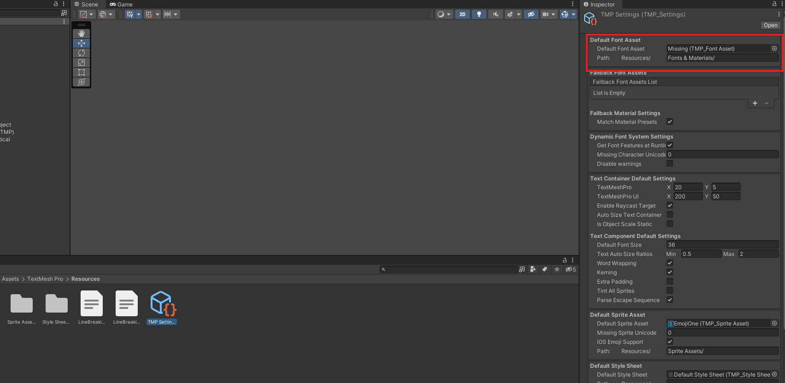
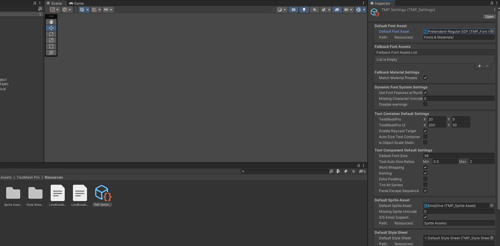
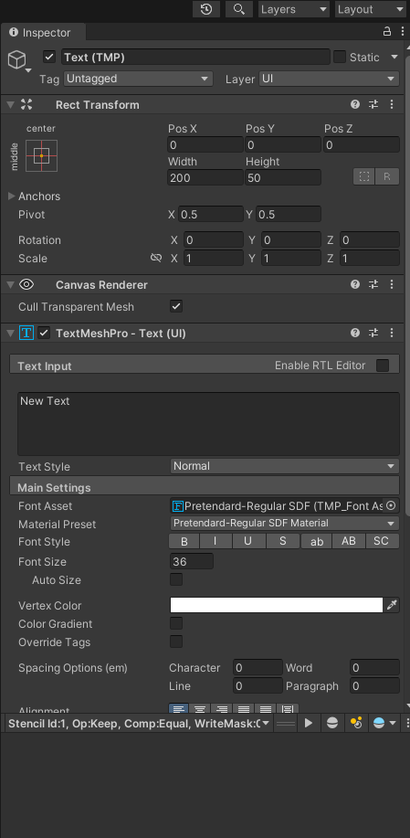

+++
author = "Araya-Mk.5"
title = "유니티 기본 TextPro 폰트 바꾸기"
date = "2023-01-06"
description = "유니티 기본 TextPro 폰트인 Liberation Sans를 원하는 폰트로 바꾸어보려고 한다."
tags = [
    "Unity"
]
categories = [
    "Unity"
]
series = ["Unity"]
aliases = ["Unity"]
image = "default-settings.png"
slug = "default-text-mesh-pro"
+++

## TextMeshPro 불편한점

유니티에서 이제는 일반 Text의 성능이 구리다고 해서 다 쳐내고 TextMeshPro를 밀어주기 시작하였다. 하지만 사용하기 쉬운 Text와는 달리 TextMeshPro는 처음에 세팅을 해주어야 한다.

그 중, 제일 불편했던 것이 유니티에 기본 탑재되어 있는 liberation Sans가 한글도 지원이 안되는 주제에 TMP_Text 생성 시, 기본으로 나와서 일일히 바꿔주어야 하는 귀찮음이 존재했다.

설정 UI에는 안보이기에 설정을 못하는 알았더니, 다른 곳에서 설정할 수 있었다.

## TMP_Settings 클릭

TextMeshPro 기본 임포트 시, Assets > TextMesh Pro > Resources에 TMP_Settings가 생성된다.

해당 리소스를 클릭하면 설정 가능한 인스펙터 창이 나온다.

여기서 Default Font Asset이 기본 폰트다.

## Default Font Asset 변경

게임에 기본이 되는 폰트로 바꿔주자.

## 테스트
그리고 생성하면?.. 성공.

