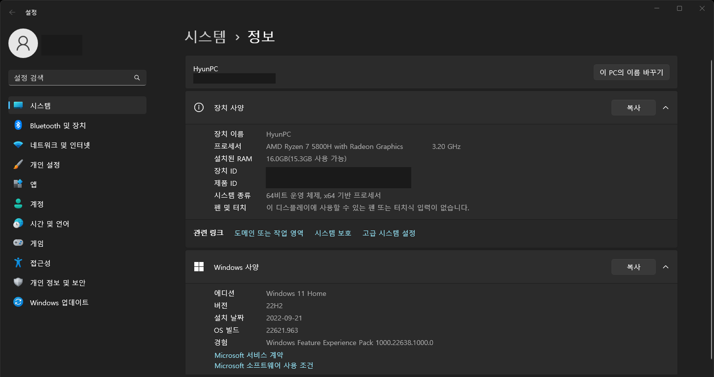

+++
author = "IceBlueHalls"
title = "[C# Error] illegal byte sequence encounted in the input."
date = "2023-10-01"
description = "Unity 데이터 통신 시 illegal byte sequence encounted in the input. 에러 발생"
tags = [
    "Unity"
]
categories = [
    "Unity"
]
series = ["Unity"]
aliases = ["Unity"]
image = "error1.png"
slug = "error-illegal-byte"
+++

## 에러 발생
유니티에서 HttpRequest를 이용하여 통신 로직을 구성하였더니 다음과 같은 에러가 발생하였다.

```csharp
Illegal byte sequence encounted in the input.
```

해당 에러들을 검색하였을 때 대부분은 **실행 경로 또는 설치 경로에 한글이 섞여있을 경우**라고 하였다.
그러나 아무리 찾아봐도 경로는 한글이 없었고 심지어 C://Unity 임에도 에러가 발생하였다.

## 기기명을 이용하는 함수

더더욱 HttpRequest에 대해 조사해본 결과, 해당 함수를 호출하는 도중에 호스트 이름을 사용하는 것을 알게 되었고, **로컬 호스트 이름=기기명**을 사용한다는 사실을 알게되었다.

그래서 다음과 같은 함수를 호출해보았다.
```csharp
using UnityEngine;

public class NewBehaviourScript : MonoBehaviour
{
    void Start() {
        Debug.Log(System.Net.Dns.GetHostName());
    }
}
```


그랬더니 위 HttpRequest를 이용한 에러와 동일한 에러가 발생하였다.

## 해결방법

기기를 확인해보니 PC 이름이 '내PC'라고 한글이 입력되어있었고...


이것을 영어로 변경하였다.


그리고 위 함수를 호출하였더니.

```csharp
using UnityEngine;

public class NewBehaviourScript : MonoBehaviour
{
    void Start() {
        Debug.Log(System.Net.Dns.GetHostName());
    }
}
```


잘 실행이 되었다.

## 결론
PC 이름이 영어가 아닌지 확인해보자!


## 추가
유니티 경로중에 Program Files등의 띄어쓰기가 있는 경로나 한글이 들어가 있음에도 에러는 발생하지 않았다.