+++
author = "IceBlueHalls"
title = "유니티 ScrollView를 이용하여 자동으로 늘어나는 퀘스트 UI 만들기"
date = "2023-01-05"
description = "유니티 ScrollView를 이용하여 아이템이 추가될때마다 늘어나는 퀘스트 UI를 만들어보려고 한다"
tags = [
    "Unity"
]
categories = [
    "Unity"
]
series = ["Unity"]
aliases = ["Unity"]
image = "13.png"
slug = "make-useful-scrollview"
+++

사실상 게임에서 아이템 리스트, 퀘스트 리스트등 여러가지 오브젝트를 균일하게 정렬하는 UI는 무조건 들어가게 된다.

근데 유니티에서는 원하는 대로 스크롤에 넣으면 정렬되는 기능은 제공하지 않고, 스크롤뷰에 여러가지 기능을 추가해야지만 원하는 리스트 UI가 완성된다.

## ScrollView 생성

ScrollView를 생성한다.

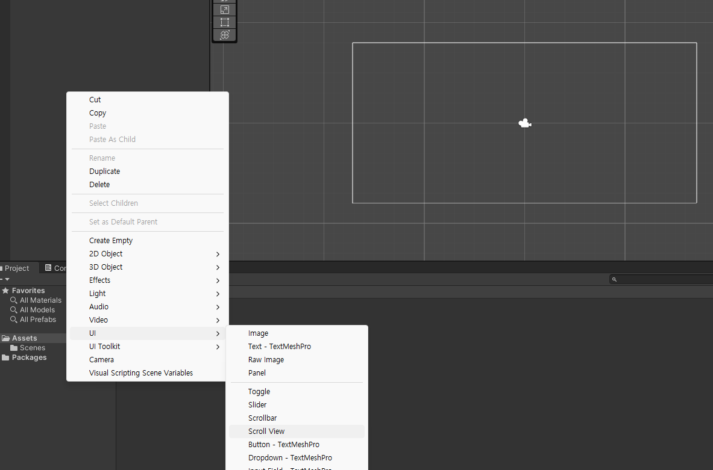

## Canvas 크기 설정

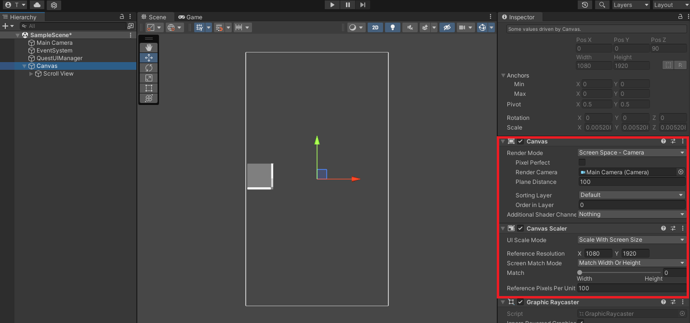

다음은 캔버스 크기를 설정해준다. 

스크롤뷰만 보이게 해주면 되는데, 여기서는 개인적으로 캔버스 크기를 설정하여 반응형처럼 UI가 이동하는 방식으로 만들었다.

### Canvas

- Render Mode - Screen Space - Camera
- Render Camera - 유니티에서 생성 시 기본적으로 제공하는 카메라

### Canvas Renderer

- UI Scale Mode : Scale With Screen Size
- Reference Resolution : 1080, 1920

## 스크롤뷰 크기 설정

보기편한대로 스크롤뷰를 설정해준다.

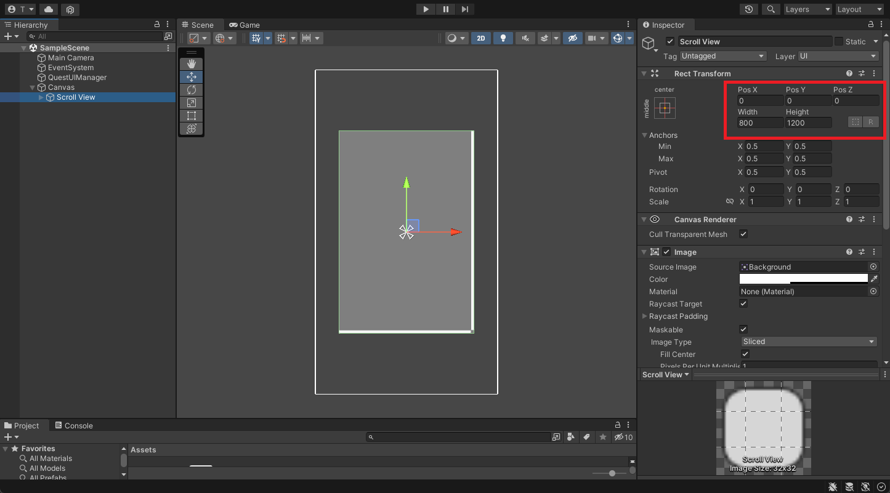

## 스크롤뷰의 Scroll Rect 설정

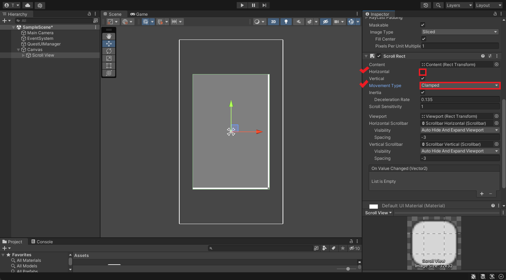

대부분의 UI에서는 왼쪽 오른쪽으로 스크롤되는 경우가 거의 없다. 단지 위아래로만 움직일 뿐.

따라서 Horizontal 기능은 필요가 없어서 체크를 해제한다.

MovementType은 설정된 크기 이상으로는 움직이지 못하게 하는 Clamped를 선택한다.

### Scroll Rect

- Horizontal : 체크 해제
- MovementType : Clamped

## Horizontal 스크롤 삭제

Horizontal을 체크해제했으므로 스크롤뷰는 작동하지 않는다. 필요가 없으므로 삭제해주자.

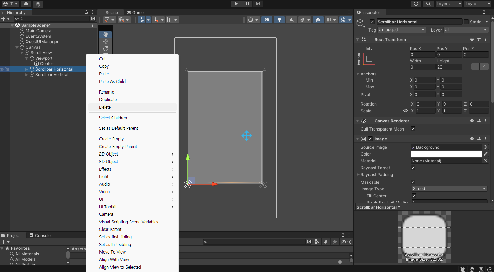

## Vertical 스크롤 크기 설정

Horizontal 스크롤이 삭제되면서 빈공간이 남게 되었다. 마음에 걸리니 빈공간 없도록 설정해주자.

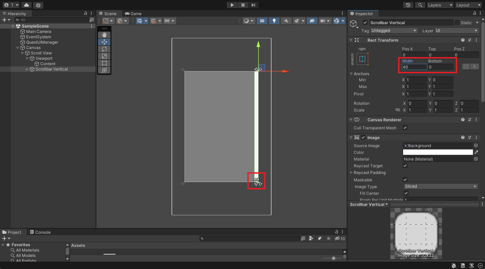

## Content 크기 설정

Content 오브젝트의 자식들은 스크롤이 되는 대상들이 된다.(부모 객체 Scroll Rect에서 자동으로 설정되어 있음)

첫 설정시에는 작은 크기 기준으로 되어있기에 스크롤뷰의 모든 범위가 되도록 크기를 늘려주자.

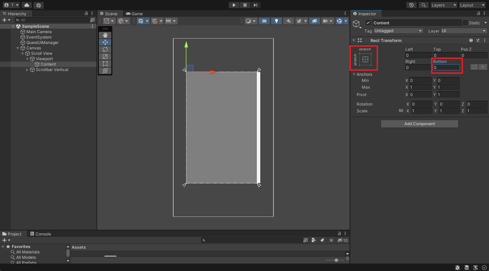

## Content에 기능 추가

자식 객체를 그냥 넣어주면 수동으로 설정을 해야만 한다. 지금부터 자동으로 정렬해주는 클래스와 크기를 자동으로 늘려주는 클래스를 생성한다.

### Vertical Layout Group 추가

- Spacing : 20(각 오브젝트끼리 여백)
- Child Alignment : Upper Center(정렬 기준, 중앙 상단부터 아래로 내려감)
- Child Force Expand : Height만 해제(자식 객체 제어 여부)

### Content Size Filter

- Vertical Fit : Preferenced Size(각 자식 오브젝트만큼 늘리기)

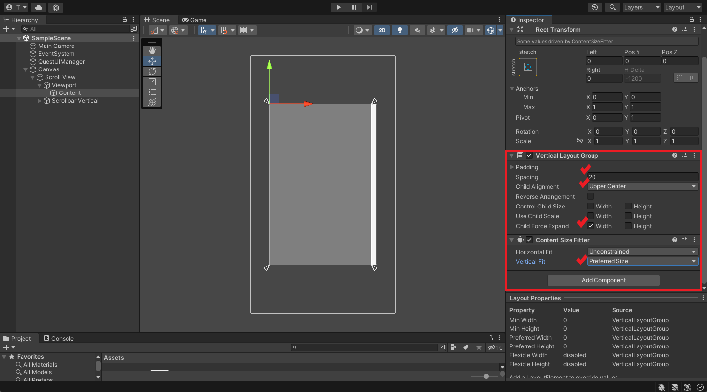

## Content의 자식 객체 추가

Content의 자식으로 객체를 추가하여 정상적으로 정렬이 되는지 확인한다.

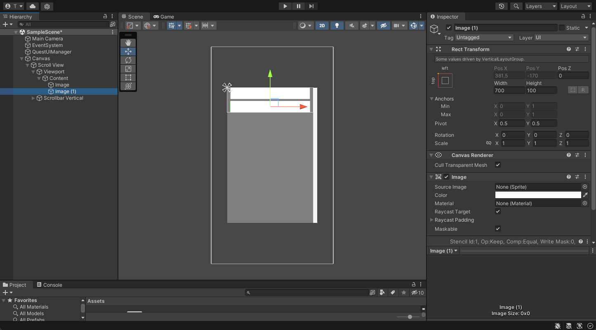

## 코드로 Content 자식 객체 생성

스크립트를 하나 생성하고, 아무 오브젝트 연결한다.

다음 스크립트는 2번째로 지정한 questionItem 오브젝트를 생성하고 1번째로 설정한 QuestionItemParent의 자식으로 옮기는 로직이다.

```csharp
using System.Collections;
using System.Collections.Generic;
using UnityEngine;

public class NewBehaviourScript : MonoBehaviour {
    [SerializeField] private GameObject questItemParent;

    [SerializeField] private GameObject questItem;

    // Start is called before the first frame update
    void Start() {
        
        // 퀘스트 아이템 10개 생성
        for (int i = 0; i < 10; i++) {
            
            // 오브젝트 생성
            var item = Instantiate(questItem);
            
            // questItemParent 오브젝트의 자식 객체로 들어감
            item.transform.SetParent(questItemParent.transform);
            
            // 아이템 생성 시, scale이 비이상적으로 커지는 경우가 있어서 1,1,1로 변경
            item.transform.localScale = new Vector3(1, 1, 1);
        }
    }
}
```

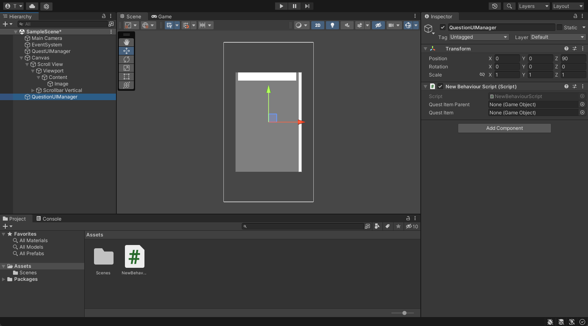

각 연결되는 오브젝트는 다음과 같다.(QuestionItem은 Prefabs여도 무관하다)

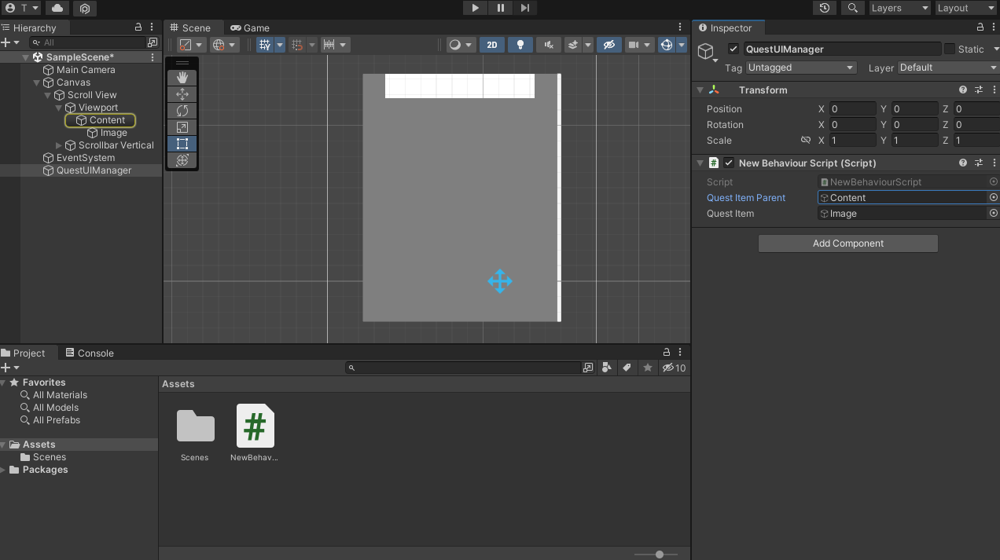

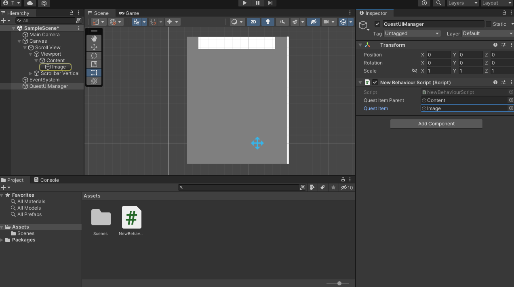

## 테스트

이제 실행해본다.

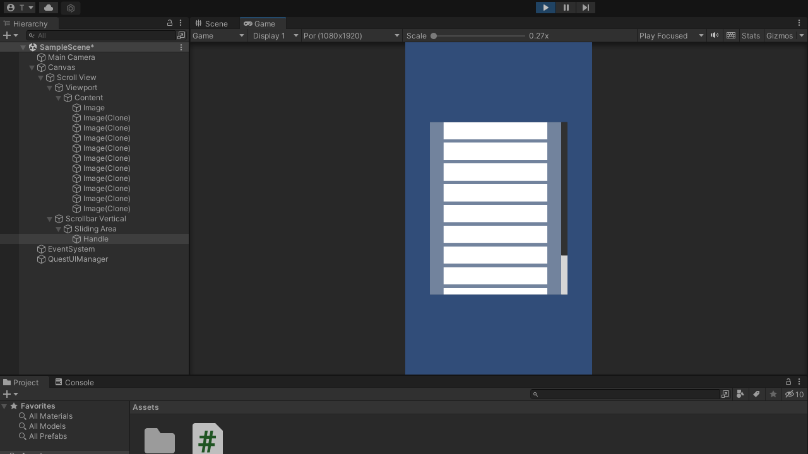