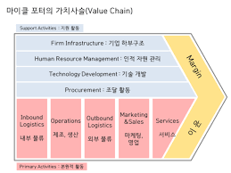

+++
author = "IceBlueHalls"
title = "경영학원론 강의 개념모음집"
date = "2023-04-23"
description = "경영학원론 강의 개념모음집"
tags = [
    "University",
    "Management"
]
categories = [
    "University"
]
series = ["Management"]
aliases = ["Management"]
slug = "management-1"
+++

## 2장

### 경제학
* 자원을 어떻게 투입할 것인지
* 최저인금, 최저시간등으로 순수한 자본주의는 존재하지 않는다.
* 국가 자본주의 : 자유시장과 정보규제의 조합(현재는 중국만 실행)

### 자본주의 4가지 기본적인 권리
* 사유재산에 대한 권리
* 사업체의 소유와 이익에 대한 권리
* 경쟁의 자유에 대한 권리
* 선택의 자유에 대한 권리

### 루즈벨트의 4가지 추가권리
* 표현의 자유
* 종교의 자유
* 욕구의 자유
* 공포로부터의 자유

### 사회주의
* 정부가 기업을 소유하여 이익이 모든 사람에게 똑같이 분배되는 경제시스템(유렵 국가들)
* 개인은 엄청난 세금을 사회보장프로그램을 위해 지불해야함
* 공동 생산은 **사회주의**, 공동 분배는 **공산주의**
* 사회적 평등이 완화되는 현상은 있지만 보상을 받지 못해 빠져나가는 두뇌 유출도 많다.

### GDP(국내총생산)
일 년간 한 국가에서 생산된 제품과 서비스의 최종 가치의 합

### GO(총생산량)
모든 생산단계의 총 판매량의 합

### 실업률
지난 4주 내에 직장을 구하려 했지만 고용이 되지 않은 자로서 최소 16세 이상의 시민의 수  
취준생은 X, 단념한 사람 X, 회사 이전자 X

### 경제의 변화
* 인플레이션 : 제품이나 서비스 가격이 상승
* 디스인플레이션 : 제품이나 서비스 가격의 증가가 느려지는 현상
* 디플레이션 : 물가가 실제로 하락
* 스태그플레이션 : 경제가 침체되고 있는데 가격이 오르는 상황

### 물가지수
* 소비자물가지수(CPI) : 인플레이션이나 디플레이션의 크기를 측정하는 월간 통계치. 주택가격, 식료품, 의류, 의약품 등 삼품과 서비스의 가격이 상승 또는 하락하는지를 계산함.  
* 코어 인플레이션 지수 : 소비자물가지수에서 식료품과 에너지 제외
* 생산자물가지수(PPI) : 생산지 시점에서 도매가격을 측정하는 지표

### 생산성
**생산성**이 **높**을수록 비용이 **낮**아지고 가격이 **낮**아지기 때문에 생산성 향상을 주요한 경영목표로 삼음.

### 네가지 경기순환의 양상
호황 - 침체 - 불황 - 회복

이때 침체는 국내총생산이 연속적으로 2분기 이상 감소 시

### 탄력성 계산
퍼센트끼리 나누기 : **(공급량 변화) / (가격)**

## 3장 - 외부환경

### 포터의 5 Forces Model
* 산업 내의 경쟁
* 잠재적인 진입자와 경쟁(닌텐도 ㅡ 핸드폰)
* 대체제와의 경쟁
* 공급자의 교섭력
* 구매자의 교섭력

### 산업구조 분석 기법
1. 산업
2. 잠재능력
3. 대체재
4. 공급자
5. 구매자

### 산업
* 산업 경쟁이 심할수록 수익성은 감소  
* 한국은 공정거래위원회에서 상위 3개 기업들의 시장 점유율에 더한 3사 집중도 지표를 발표.
* 경쟁기업의 동질성과 이질성 여부(전략,목적,유사성)
* 목적이 유사할 경우 암묵적인 단합이 용이. 기업의 강도가 비슷할수록 경쟁의 강도는 심화
* 제품차별화 필요
* 생산설비와 수요가 일치할수록 기업의 수입률이 높아짐
* 비용구조 : 설비투자로 인한 고정비용의 비중이 큰 경우, 기업들은 생산 설비의 활용도를 높이기 위해 가격 경쟁 시도.

### 잠재적 진입자
* 산업 내 진입장벽의 유무와 관련이 높음(자본소요량, 경제, 비용우위, 노하우, 제품 차별, 유통 채널의 접근 가능성)
* 진입장벽 회피하기 : 진입장벽을 피하기 위해서 새로운 기술, 새로운 경영, 새로운 브랜드를 시도(반디앤루이스와 아마존, Dell)

### 대체재와의 경쟁  
다음과 같은 특성의 대체재가 존재하는 경우, 서비스에 높은 가격 측정 불가
* 소비자들이 쉽게 대체재로 옮겨갈 수 있는 경우
* 대체재의 유용성이 높은 경우

### 구매자/공급자의 교섭력
* 구매자들이 가격에 민감
* 구매규모 혹은 공급규모의 크기
* 구매자/공급자의 제품, 가격, 비용구조에 대한 정보의 차이
* 제품 브랜드변경, 번호 이등의 크기
* 구매자/공급자들의 수직적 통합유무(현재차가 타이어 회사 만들기)

### 내부역량분석(초중요)

* 각 단계별 뛰어난 회사와 비교
* 기업의 활동을 이해하기 위한 분석 방법
* 기업의 핵심역량을 단순한 기능별 능력으로 고려하는 대신에 여러 기능별 능력들이 조합된 조직상의 능력으로 보아야함
* 핵심역량은 단순히 잘하는 활동이 아니라 경쟁기업과 비교하여 항상 그 기업이 더 잘할 수 있는 상대적인 경쟁능력을 의미

### 핵심역량 특징
* 최종제품으로부터 고객이 느끼는 편익을 증대
* 경쟁자들이 흉내내기 어려워야함
* 핵삼역량을 파악하는 것은 수직적 통합 및 아웃소싱과 관련한 의사결정의 주요 판단근거가 됨.
* 기업의 글로벌화 촉진
* 전략적 제휴를 효과적으로 운용

## 5장, 글로벌

### 무역수지
일정기간동안 한 나라의 전체 수입금액에 대비한 전체 수출금액

### 덤핑
상품 가격을 국내보다 수출국 현지에서 더 낮추어 판매하는 행위

### 글로벌 시장으로 가기 위한 전략들
* 라이선싱
* 수출
* 프랜차이징
* 위탁제조
* 국제적 합작투자와 전략적 제휴
* 해외직접투자

### 라이선싱
* 어떤 기업이 다른 해외 기업에 돈을 받고, 상품을 생산할 수 있도록 허가.
* 일반적으로 자국 시장에서 얻을 수 없는 추가적 수익 확보
* 생산 및 마케팅에 적은 비용

### 수출
* 구매자와 판매자를 연결

### 프랜차이징
* 좋은 비즈니스 아이디어의 사람이 특정 지역에 한정된 고객들을 대상으로 사전에 고안된 방식을 통해 제품이나 서비스 사용할 권리를 판매

### 위탁제조
*  OEM은 생산만, ODM은 모든 단계
* 공장 설립과 같은 진입비용에 따른 부담을 주지 않고 새로운 시장을 경험할 기회 제공
* 목표 시장 침투에 수반되는 위험 수준 낮춤

### 합작투자
* 둘 또는 그 이상의 기업이 맺은 파트너쉽
* 중국은 진입 시 중국회사 한 곳과 손잡아야함
* 기술과 위험, 마케팅 역량과 경영 경험을 공유 가능

### 전략적 제휴
* 시장 경쟁력을 가질 수 있도록 상호 협력하기로 한 둘 또는 그 이상의 기업들 사이의 장기적 비즈니스
* 비용, 제반 위험, 경영과 관련된 사항이나 이익도 공유하지 않음
* 홀로 시작할 때의 시장, 자본, 기술적 전문성에 따른 어려움 해소

### 해외 직접투자
* 외국으로부터 영구적인 재산이나 사업체를 구입하는 행위

### 다국적 기업
* 물리적인 실체, 생산능력을 나타내는 제조설비 같은 것이 여러 다른 국가에 위치하고 있을 때에만 우리는 이 기업을 다국적 기업이라고 부를 수 있음.

### 국제무역에 영향을 미치는 요인들
* 사회문화적 요인
* 경제적, 재무적 요인 - 환율, 변동환율제도, 평가절하(다른 국가의 통화에 비해 자국 통화를 낮춰 외국 수출 목표)
* 법, 규제적 요인
* 물리적, 환경적 요인

### 보호무역주의
* 정부가 규제를 통해 제품이나 서비스의 수입을 막는 것
* 관세는 보호 측면과 수익 측면
* 수입쿼터(상품의 수입량 제한)와 금수조치(첨단무기, 특정 상품의 수입이나 수출에 대한 금지)
* 관세무역일반협정(GATT), 세계무역기구(WTO)
* 관세 철폐및 무역 촉진을 위한 공동시장 : EU, ASEAN, 메르코수르, COMESA, NAFTA, CAFTA

### 글로벌 무역의 당면과제 : 아웃소싱
* 기업의 기능 중 일부 또는 전부를 다른 기업과 계약을 맺어 조달(아프리카 생산)

## 6강, 사업 소유구조

미국
1. 합명회사 : 2인이상 무한책임
2. 합차회사 : 1인 무한 + 1인 유한
3. 주식회사
4. 유한회사 : 책임회사와 비슷. 전직원 지분있음
5. 유한책임회사 : 지분판매 X. 판매 시 다른 사람 양해

개인 기업
* 특별세 없음
* 4대 보험 스스로
* 주요인물 사망 시 종료

파트너쉽
* 일반적 파트너 : 무한 책임 파트너
* 유한 파트너 : 자금 투자 O, 일정 이상의 경영 책임이나 손실 책임 X
* 특별세 없음

파트너 고르기 주의점
* 파트너십에서 일정 수준의 즐거움을 기대할 수 있는가?

회사
* 공인 법적 단체
* 사장이 죽어도 안끝남
* 소유 변경의 용이성
* 소유와 경영의 분리(무조건 장점만은 아니다)
* 아중 과세

합병
* 수직적 합병 : 관련 사업에 종사하는 다른 단계의 두 기업의 합병(현대차와 금호타이어) - 경쟁사 기회 X
* 수평적 합병 : 동일 산업의 두 기업의 합병(현대차와 도요타) - 제품의 다양성
* 혼합 학병 : 비관련 산업에 종사하는 두 기업의 합병(현대차와 맥도날드) - 위험분산

차입매수
* 피고용인, 경영측, 혹은 투자자가 차입을 통해 사전에 회사를 매수하는 방식
* 회사를 담보로 은행에서 50억 회사 사람끼리 모아서 50억으로 10%만 벌어도 빚 갚기에는 충분(50억이자의 2.5% = 5억)

프랜차이즈
* 권한과 제품을 판매 혹은 서비스 제공
* 연미복 효과
* 매각 제한
* 도미노피자는 소수인종프랜차이즈 모집 프로그램
* 자체 웹사이트 금지

협동조합
* 한살림(유기농 판매처)이 대표적
* 모두 같이 운영하며(회사는 상위 소수만) 돈보다는 정신이 우선
* 가입을 하지 않으면 안팔고 못 산다.

# 7장, 리더쉽

경영자의 역할(계조충지통)
1. 계획 - 치킨 가게 해야지
2. 조직화 - 레시피, 가게 인력 확보, 홍보 계획
3. 충원 - 스타트하여 창업 성공
4. 지휘 - 운영
5. 통제 - 피드백

## 계획
* 비전과 사명 선언 고르기
* 비전은 매출액등 구체적인 답변 필요
* 기본적인 질문들에 답함 : SWOT 분석

### 계획 기능
1. 전략적 계획 - 최고경영진이 포괄적인 목표 설정(장기지침)
2. 전술적 계획 - 하위 관리자들이 구체적이고 좁은 범위의 목표들 설정(단기지침)
3. 운영 계획 - 업무 기준과 일정의 설정
4. 상황 대응 계획 - 최초 계획이 실패할 경우에 필요한 대안 계획(많이들 안함)

### 의사결정의 6가지
1. 상황 정의
2. 필요한 정보 확인 및 수집
3. 대안 개발
4. 대안 최선 결정
5. 지시 수행
6. 결정이 옳은 것인지 확인 및 점검

### 문제해결
1. 브레인스토밍 - 아이디어 검열 없이 많은 해결책 제시
2. PMI - 해결책의 모든 장점 한열에 나열, 단점은 다른 열에, 세번째 열에는 그에 따르는 의미 나열

## 조직화
1. 최고경영진 - 사장과 전략적 계획 수립(개념 우선)
2. 중간관리층 - 전술적 계획과 통제 책임(3개 모두 비슷슷)
3. 현장관리층 - 종업원 감독 및 성과 평가(사무 우선)

### 경영자의 세가지 기술
1. 사무적 기술 - 조직에 대한 큰 그림 제시
2. 대인관계 기술 - 의사소통과 동기 부여
3. 개념적 기술 - 업무 수행

## 지휘

### 리더의 의미
* 비전 제시, 사람 규합
* 기업 가치 구축
* 기업 윤리 촉진
* 변화 포용
* 책임과 책임감 조성
* 투명성(회계 공개)

### 리더쉽의 유형
* 전제적 리더쉽 - 다른 이들과 상의 X, 혼자 의사결정(비숙력자 모임에 적합)
* 참여적 리더쉽 - 의사 결정 과정에서 관리자와 종업원이 함께 참여
* 자유방임적 리더쉽 - 목표만 설정하고 나머지는 자유(연구실)

### 권한부여
* 의사결정을 위해 필요한 교육과 도구를 직원들에게 제공하는 과정
* 현대적 리더들은 지침을 줄임
* 경영자는 상사나 지시자보다는 코치, 비서, 상담자의 역할

### 지식관리
적합한 정보 검색, 필요한 정보 서칭 가능

## 통제
구체적인 숫자와 날짜가 있어야한다. 요즘에는 고객 만족이 우선이다
1. 명확한 기준의 설정
2. 성과의 감독 및 기록
3. 기준 대비 결과의 평가
4. 결과의 소통
5. 필요한 경우 수정