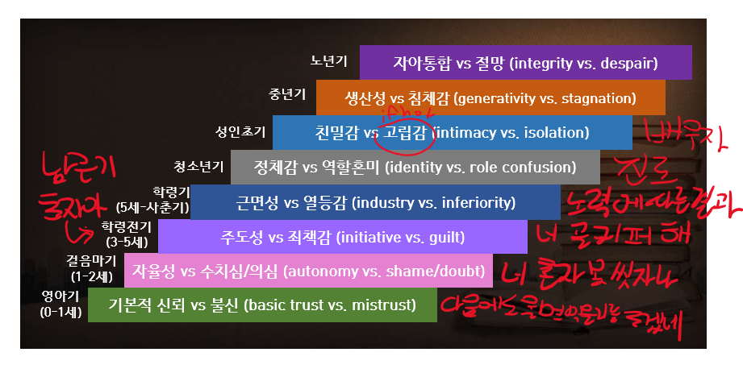

+++
author = "IceBlueHalls"
title = "심리학 강의 10강 - 평생발달과 변화2"
date = "2023-04-15"
description = "심리학 강의 10강 - 평생발달과 변화2"
tags = [
    "University",
    "Psychology"
]
categories = [
    "University"
]
series = ["Psychology"]
aliases = ["Psychology"]
slug = "psychology-10"
+++

# 평생발달과 변화
## 애착
* 유아와 양육자 간의 정서적 유대감
* 영아가 양육자와 가까이 있으려 하고, 분리도리 때 불안해하며, 양육자에게 안정감을 얻는 경향
* 양육자와의 시간(상호작용)이 필요
* 큐피 인형 효과 : 아이와 현상이 비슷한 얼굴이 크고, 몸통이 작은 캐릭터를 좋아함

### 애착은 어떻게 형성되는가
부드러운 접촉(무조건 자극) + 양육자(조건 자극)

### Ainsworth낯선 상황 실험
아이와 엄마가 한방에 있다가 엄마가 나감. 아이의 행동 관찰
* 안전 애착 60~65% : 양육자가 곁에 있을때는 편함. 떠나면 불안. 다시 찾으면 편안(엄마가 요구 해결을 잘해줌)
* 불안전-회피 애착 20% : 양육자가 있거나 없ㅇ르 떄 모두 양육자에게 관심을 갖지 않음(엄마가 요구 해결을 안해줌)
* 불안정-저항 애착 10~15% : 양육자가 있어도 주위에 관심이 없고 양육자와 가까이 있으려함. 양육자가 떠나면 매우 강한 고통을 표현. 재결합에도 불안(요구를 들어줄때도 안들어줄때도 있음. 요구를 위해 울어버림. 요구해결해줄지 몰라서 울어버림)
* 불안정-혼동 애착 : 양육자가 나가고 들어올 때 혼란스럽고 비일관적인 반응을 보임(요구해결 + 학대)

### 애착 유형 결정 요인
* 양육의 질 : 민간한 반응(인정애착), 아이의 욕구에 따른 반응
* 아이의 기질 : 특정 방식으로 행동하게끔 타고난 성향 : 순한 기질, 까다로운 기질, 더딘 기질
* 양육자와 자녀의 조하 가능성 : 얼마나 양육자와 믿나

### 초기 애착의 사회인지적 영향
#### 인지적 영향
* 안정애착아 : 낯설거나 복잡한 과제에 적극적 탐색(모르면 어케든 품) - 나와 남에 대한 생각을 알게 됨.(남이 내 문제를 해결해줘서 편안하게 줌. 타인은 내 문제를 해결해주는 편안한 사람, 나는 타인이 도움을 주는 괜찮은 사람, 자신감 업)
* 불안정애착아 : 낮은 지적 호기심, 낮은 과업몰임, 낮은 과업 즐거움(자기 혼자 앓음, 스스로 해결해야함, 어느정도 자신감은 있음, 타인은 내 문제를 해결해주지 않음. 타인에 대한 부정적, 자신이 하다 안되면 그냥 포기)

#### 사화적 영향 
* 친구관계 : 인기, 지도력, 사회적 지위(애착에 따라 친구가 다를 수 있다)
* 이성/부부 관계 : 소유적(자존감 낮음), 유희적(타인신뢰X), 동료적 사랑
* 자녀와의 관계
* 엄마와 영아의 애착유사성
* 애착의 역사는 운명인가(바꿀 수 있다!)

#### 애착의 질은 이후 삶을 예측하는가?
* 초기 양육자와 상호작용을 통해 자신과 타인에 대한 인지적 표상을 형성한다.

### 전생애적 발달
#### 심리사회적 발달 이론
* 프루이드보다 사회적인 면 강조
* 전 생애또한 해결해야할 심리사회적 위기
* 사회적 상호작용을 통해 각 발달단계의 위기를 어떻게 해결하는가에 따라 사회적 성격이 결정

* 영아기(0~1세) : 다음에도 울면 먹을 것을 주겠네
* 걸음마기(1~2세) : 친구들 다 혼자 씻는데 나는 혼자 못씻네. 부끄러워
* 학령전기(3~5세) : 남근기에 초자아가 생김. 너 골키퍼 해.(죄책감 생김)(프루이드는 내 성적 욕구 해결, 에릭슨 어떤 사회적 작용에 초점)
* 학령기(5세 ~ 사춘기) : 노력에 따른 결과를 믿음. 나 공부 20점 맞고 못하는구나. 옆 사람은 잘하는 구나.
* 청소년기 : 난 잘하는 게 뭐지?(여러가지를 해보는 역할 실험. 요리, 컴퓨터, 그림등. 누워있어서 재능을 찾을 수 없음.)
* 성인초기 : 애인, 배우자, 자녀가 생김.(친밀한 관계를 맺는 시기. 못맺으면 고립감)
* 중년기 : 자녀교육비 벌기. 다음 세대를 보살피고 배려하기 위해 자신의 내적 자원을 이용하는 과정(자녀양육, 생산) 없으면 침체감(누구에게도 관심, 배려없이 자신의 욕구 충족에만 몰두)
* 중년기 : 자녀가 또나고 빈 둥지 시기가 됨. 다시 배우자와 단둘이 남으면서 사이가 좋아지거나 나빠짐.
* 성인후기 : 자아통합(자신의 인생을 돌아보면서 그 의미를 수용). 잃어버리는 발달. 감각 쇠퇴. 반응속도 감소. 은퇴. 배우자/주변인 사망

#### 쿠블러-로스 : 죽음에 대한 자세
1. 부정(병원 크로스 체크)
2. 분노(착하게 살아왔는데, 이게 시련인가?)
3. 흥정(n개월까지만 살게 해주세요)
4. 우울(하아..)
5. 인정(인간의 순기능이다)

#### 청소년기
정체감 vs 역할혼미
* 나는 누구인가
* 나에게 무엇이 소중한가
* 어떻게 살아야 하는가
* 무엇을 하며 살아야하는가
* 역할 실험(뭘 잘하는가)