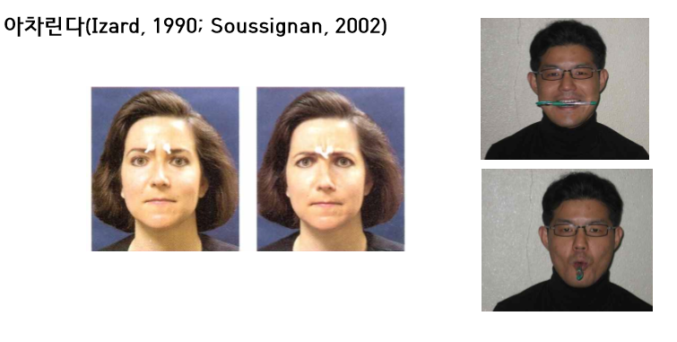

+++
author = "IceBlueHalls"
title = "심리학 강의 3강 - 신경과학"
date = "2023-03-18"
description = "심리학 강의 3강 - 신경과학"
tags = [
    "University",
    "Psychology"
]
categories = [
    "University"
]
series = ["Psychology"]
aliases = ["Psychology"]
slug = "psychology-3"
+++

## 뉴런과 신경전달물질

### 뉴런
뉴런 : 정보 전달(수상돌기, 세포체, 축색)
교세포 : 뉴런 지지

뉴런 간 신호전달 : 화학적  
**핵심 : 신경전달물질**
1. 뉴런에서 전기적 반응이 축색을 따라 종말 단추로 전도
2. 동말 단추 도달 시, 스냅스 낭을 파열시켜 신경전달물질을 시냅스 간극으로 방출.
3. 시냅스 공간으로 되돌아 온 신경전달물질 중 일부는 그 물질을 방출한 뉴런으로 흡수 나머지는 분해.

### 신경전달물질

#### 도파민
몸놀림 기능 :  
도파민 부족 시 정보 전달이 안되서 몸을 못 움직이는 파킨슨 병 발생 -> 도파민 합성재로 치료

각성, 기분, 사고 기능 :  
도파민 과다 시 정신분열증(조헌병) -> 도파민 대항제로 치료

#### 세로토닌
기분, 각성, 수면, 섭십 기능  
부족시 우울 장애 - 세로토닌 작용제로 치료(햇빛과 반식욕도 세로토닌 채워줌)

#### 엔도르핀
쾌감, 통증 감소 기능
Runner's high, 위약 효과 시 방출 - 고통을 덜어주기 위해 엔도르핀 강제 활성(모르핀, 헤로인)

플라시보 혀과로 안 아프다 믿으면 실제로 엔도르핀이 나와 고통을 줄여주면서 안아프게 된다.

## 신경계

신경계
* 중추신경계
    * 뇌
    * 척수 : 고통
* 말초신경계
    * 체성 신경계 : 몸의 움직임 명령
    * 자율 신경계 : 동공, 심장 멈추기, 정서

## 자율신경계
정서를 조종(얼굴 근육)

1. 자율신경계의 생리적 흥분
2. 신체 움직임, 얼굴 표정등 근육의 움직임
3. 특정 정서를 느낀다는 의식

어느것이 먼저일까?

### 안면 피드백 효과
근육먼저설: 뇌는 얼굴근육에서 뇌로 전달되는 신호를 통해 자신이 어떤 정서를 경험하고 있는지 알아차린다.

### 정서의 두 요인 이론
Schachter와 Singr의 두 요인 이론  
정서적 경험은 자신의 생리적 각성을인지적으로 어떻게 평가하느냐에 따라 결정된다.  
생리적 각성/흥분 + 인지적 평가

놀이기구와 사랑 모두 심장이 빨라진다는 공통점이 있지만 하나는 스릴을 즐긴다는 인식이, 하나는 사랑한다는 인식이 있어서 다른 정서가 된다.  
흔들다리 효과 : 심장이 뛴다는 조건이 있을 떄 정서가 착각하여 공포를 사랑으로 인식하는 경우도 있다. 

## 뇌
뇌는 대뇌피질, 변연계, 중심핵으로 구성.

### 중심핵(뇌간)

#### 연수
* 생명유지기능(심장박동, 호흡)
* 좌우 신경 교차

#### 망상체
* 주의집중, 각성  
* 고양이 망상체 자극 -> 각성, 제거 -> 혼수상태

#### 소뇌
* 몸놀림, 균형감각, 운동학습(본능적인 근육 움직임)

#### 시상
* 감각정보의 대뇌 전달

#### 기저핵
* 신체움직임(파킨슨병, 알콜영향)

### 변연계

#### 시상하부
* 기본 욕구 조절 : 먹기, 마시기, 성 행동 등
* 쾌락 중추
* 자극 시 하루종일 쾌락 추구

#### 헤미
* 기억을 담당

### 편도체
* 정서 조절 : 공포, 분노, 공격성
* 편도체 제거 원숭이 -> 온순
* 편도체 자극 고양이 -> 공격 태세
* 해마는 편도체와 붙어있어서 공포나 화가 나는 기억은 잘 난다.
* 본능적 공포 또한 이런 편도체와 해마가 붙어있어서 발생.

### 대뇌피질
* 전두엽
* 두정엽
* 후두엽
* 측두엽

#### 체성감각피질
* 입력을 담당
* 좌반구는 신체의 우측에서 입력을 받아들인다.
* 얼굴 - 엄지 - 손 - 팔 - 목 - 몸통 - 엉덩이 - 발가락 - 치아 - 잇몸 순으로 아프다.

#### 운동피질
* 출력을 담당
* 좌반구는 신체의 우측을 통제한다.
* 얼굴 - 엄지 - 손 - 팔 - 목 - 몸통 - 엉덩이 - 발가락 - 치아 - 잇몸 순으로 정교하다.

왼손을 잡음 > 척수 > 대뇌피질 > 체성감각피질 > 우측 뇌 > 뿌리 쳐! > 운동 피질 > 우측 뇌 > 척수 > 왼쪽에 전달

#### 시각피질과 청각피질
후두엽이 다치면 눈이 안보일 수 있음.

#### 연합피질
* 고등 동물일수록 연합영역이 증가
* 모든 고등 정신 활동(결정, 사고, 언어)는 연합피질에서 이루어진다.
* 전두엽 연합 피질이 손상될 경우 사고 능력과 결정 능력이 떨어지고 충동적으로 행동하는 사람이 발생.

#### 언어 관련 영역

**브로카 영역**
* 언어 표현 기능
* 손상시 표현성 실어증(브로카 실어증)
* 손상시 말을 이상하게 함

**베르니케 영역**
* 언어 이해, 읽기 관련
* 손상시 수용성 실어증(베르니케 실언증)
* 말은 이상하지 않은데 내용이 이상함

### 뇌량
좌반구와 우반구의 명령을 공유하는 고속도로 역할
