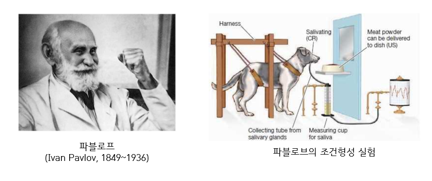
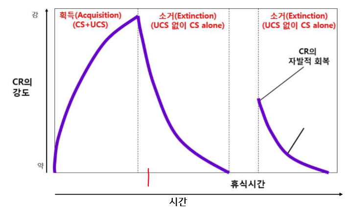
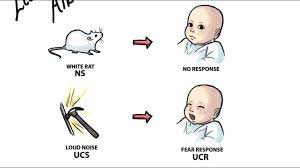
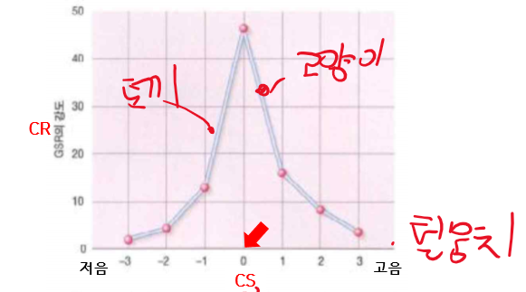
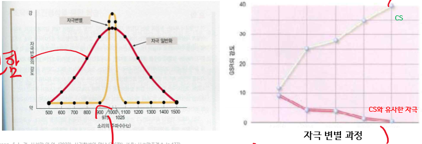
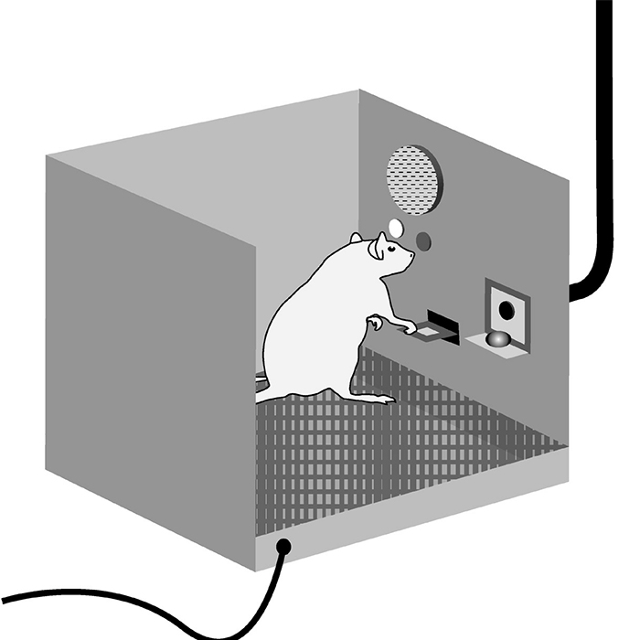

+++
author = "IceBlueHalls"
title = "심리학 강의 4강 - 학습"
date = "2023-03-25"
description = "심리학 강의 4강 - 학습"
tags = [
    "University",
    "Psychology"
]
categories = [
    "University"
]
series = ["Psychology"]
aliases = ["Psychology"]
slug = "psychology-4"
+++

# 학습

## 학습의 정의
학습 : 경험을 통해 얻은 행동과 지식의 비교적 영속적인 변화

## 고전적 조건형성이론
Pavlov의 고전적 조건형성 실험

### 기본원리

음식(무조건 자극) -> 침(무조건 반응)  
UCS(Unconditioned Stlmulus) -> UCR(Unconditioned Response)

음식(무조건 자극) + 종소리(중립/조건 자극)  
UCS와 NS(중립 자극)/CS 연합  
(종소리는 기존에는 반응하지 않음)

종소리(조건 자극) -> 침(조건 반응)  
CS(Conditioned Stimulus) -> CR(Conditioned Response)

음식 = 종소리와 동일시 되면서 음식과 같은 자극이 된것

학교 공포증 :  
구타 폭행 -> 공포    
구타 폭행 = 학교  
학교 -> 공포

### 획득,소거,자발적 회복
획득 : 조건자극(CS)에 대해 새로운 반응(CR)을 얻는 것

소거 : 무조건 자극(UCS)없이 **조건 자극(CS)만** 반복될 때, 조건 자극(CS)에 대한 조건 반응(CR)이 줄어드는 것.  
(구타 없이 학교만 다니면 학교의 공포는 점점 없어진다.)

자발적 회복 : 소거 진행 동안 휴식을 가진 후 조건 반응(CR)의 강도가 부분적으로 회복되는 것.  
(여름 방학 지나고 갑자기 등교에 대한 공포감이 살짝 드는 것)

### Watson의 정서 조건형성

Watson 왈 : 나에게 건강한 아이를 맡긴다면 변호사, 예술가, 거지와 도둑까지 되게 할 수 있다.  
(행동주의)

1. 처음에는 아기가 쥐를 무서워하지 않는다.
2. 쥐가 있을때마다 큰소리를 내서 아기를 무서워하게 한다.
3. 이후에는 쥐만 나타나도 아기가 무서워한다.

### 자극일반화와 변별

#### 자극일반화

CS(쥐)와 유사한 자극에 대해서 CR을 일으키는 현상
제시되는 자극이 CS와 유사할수록 CR의 강도가 강함

위 실험에서 쥐 대신 쥐와 비슷한 아르마딜로, 쿼카, 토끼등으로 바꾸어도 똑같이 무서워하는 반응이 나올 수 있다.  
다만 토끼, 털뭉치등은 자극이 유사하지 않아 CR의 강도가 약할 수 있다.

#### 자극변별
CS에 대해서만 CR이 나타나고 CS와 유사한 자극에 대해서는 CR이 나타나지 않음.  
CS에는 UCS가 뒤따르고, 유사 자극에는 UCS가 뒤따르지 않을 때 발생.

## 조작적 조건형성
만족스러운 결과를 가져오는 행동은 강화되고, 불만족스러운 결과를 가져오는 행동은 약해진다.

스키너 박스 : 버튼을 누르면 음식이 나오는 방에 쥐를 가뒀는데, 쥐가 버튼을 누르자 음식이 나오는 것을 보고 버튼만 누르기 시작했다.

### 강화
행동의 결과로 행동의 빈도가 **증가**하는 과정  
강화물 / 강화인 : 반응의 발생 가능성을 **증가**시키는 자극(보상, 칭찬, 점수)

#### 정적 강화
특정 행동 뒤에 **주어지는 자극**으로 인해 행동 빈도가 **증가**하는 과정  
(음식,칭찬,돈,학점,인정 등)

#### 부적 강화
특정 행동 뒤에 **사라지는 자극**으로 인해 이후 행동 빈도가 **증가**하는 과정  
(과제 감소, 수업시간 단축 등 사라지는 보상)

### 처벌
행동의 결과로 행동의 빈도가 **감소**하는 과정
처벌제/처벌인 : 반응의 발생 가능성을 **감소**시키는 자극(체벌, 반성문, 잔소리)

#### 정적 강화
특정 행동 뒤에 **자극 제시**로 인해 이후 행동 빈도가 **감소**하는 과정  
(체벌,잔소리,반성문)

#### 부적 강화
특정 행동 뒤에 **자극 제거**로 인해 이후 행동 빈도가 **감소**하는 과정  
(벌금, 타임아웃 등)

### 조형
최종 목표 행동과 유사한 행동부터 강화하기 시작.  
빈도가 늘어나서 목표 행동에 더 가까운 행동이 발생하면 유사 행동를 중지하고, 최종 목표에 더 가까운 행동을 강화한다.  
(돌고래에게 물속에서 훌라우프 통과를 시키면 그 이후에는 수면 위에 훌라우프를 배치한다.)

## 인지학습

### 통찰학습
본능적으로 학습하는 것.  
원숭이가 철창을 나오기 위해 도구를 사용하거나, 높은 곳에 올라가기 위해 주변 박스를 받침대로 사용하는 것.

### 관찰학습
사회 학습(알프레드 밴드러)  
아이에게 복싱 영상을 계속 보여주었더니 아이가 따라하기 시작.  
폭력적인 영화를 많이 보고 아이들이 패싸움을 하는 등.

관찰학습 4단계  
주의 > 회상 > 재생 > 동기