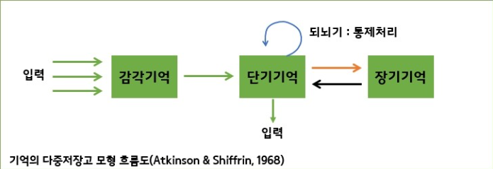
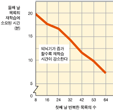
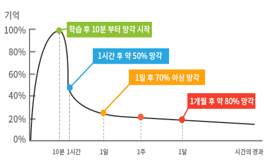
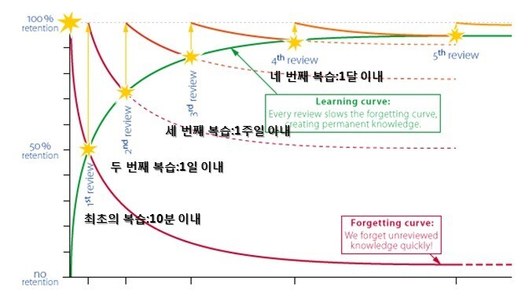
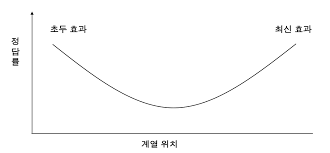
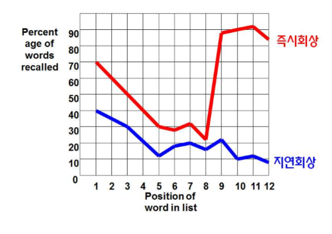

+++
author = "IceBlueHalls"
title = "심리학 강의 5강 - 기억"
date = "2023-04-01"
description = "심리학 강의 5강 - 기억"
tags = [
    "University",
    "Psychology"
]
categories = [
    "University"
]
series = ["Psychology"]
aliases = ["Psychology"]
slug = "psychology-5"
+++

# 기억

## 정보처리이론
정보처리 : 부호화 > 저장 > 인출

## 전통적 기억 모형
Atkinson & Shiffrin 제작

## 감각기억
용량 : 매우 큼  
지속 시간 : 시각 1초, 청각 4초. 집중하면 단기기억으로 이동.

## 단기기억
용량 : 7~9 청크(의미를 지닌 단위). 의미를 부여하면 1청크가 되며 더 많이 기억할 수 있다. 
지속시간 : 20~30초. 유지시연(반복 암기) 할수록 올라감.  

419518625717815 <- 그냥 외우기 힘듬(15청크)  
419/518/625/717/815 <- 외울만함(5청크)

## 장기기억
용량 : 무제한  
지속시간 : 장기간(영구적)

해마가 단기기억에서 장기기억으로 부호화(인코딩)시킴

## 효과적인 부호화 방법

### 유지시연
정보의 반복적 순환 - 단순 반복 기억

### 정교화 시연
새 정보를 장기기억에 이미 저장된 정보와 연결하여 시연

419518625717815 <- 그냥 외우기 힘듬(15청크)  
419/518/625/717/815 <- 외울만함(5청크)

내 기억속 역사와 연결. 만약 역사 지식이 없으면 연결 불가.

### 에빙하우스
에빙하우스 암송 효과 실험

무의미 철자 목록 기억 과제 :  
DFD, DFS, DFS ,JBC, CNB, CKX, HFS

## 부호화 구체성 원리

### 상태-의존적 기억
취했을 때 부호화한 정보는 취했을 때 기억난다.  
아플 때 부호화한 정보는 아플때 기억난다.

### 기분-의존적 기억
슬플 때 저장된 기억은 슬플때가 인출 단서가 되면서 잘 떠오른다.

### 맥락-의존적 기억
스쿠버 다이버가 시험 공부를 물속에서 한다면 시험 볼때에도 물속에서 보면 지상보다 점수가 좋다.  
시험 공부도 집이 아닌 시험 보는 곳에서 공부하면 기억이 더 잘난다.

## 인출

### 회상
기억 속의 정보를 아무 단서 없이 인출(그냥 상상, 주관식)

### 재인
단서 제시 후 기억 속 정보와 단서의 일치여부 판단(몽타주, 객관식)

## 망각

### 부호화 실패 이론
집중하지 않으면 감각기억에서 금방 빠져나가서 기억나지 않는다.  
동전의 세세한 부분까지 기억하지 못해 진짜 동전을 찾으라고 하면 못찾을 수도 있다.

### 저장 소멸 이론
정보가 시간이 지날수록 점차 소멸되고, 결국 기억 흔적이 소멸되어 사용할 수 없으므로 망각한다.

대처법 : 복습해라

### 간섭 이론
 
#### 순행간섭
과거 학습이 새로운 정보의 회상을 방해

옛 집 주소는 기억이 나는데 새로운 집 주소가 기억이 안나네...

#### 역행간섭
새로운 학습이 기존 정보의 회상을 방해

지금 집 주소는 기억이 나는데 옛날 집 주소가 기억이 안나네...

### 즉시 회상, 지연회상

나는 가수다에서 7명이 노래하고 1위를 투표한다.  
마지막 가수가 끝나자마자 바로 투표를 실시하면 순행간섭이 일어나서 앞부분은 기억이 안나고, 마지막 가수만 단기기억과 함께 기억이 잘난다.  
마지막 사람이 뽑히는 경우가 많다.

발표를 기억에 남기고 싶으면 평가가 모든 발표 이후 즉시라면 후반에, 모든 발표 이후 일주일 뒤라면 집중력이 향상된 초반부에 하는 것을 추천.

### 단서-의존이론
정보가 전달되어 있지만, 찾지 못해서 인출하지 못함.  
설단 현상(아 그.. 거시기..그거)

## 망각하지 않으려면?

**부호화 실패 이론** : 철처히 부호화(집중)하자

**저장 소멸 이론** : 정기적으로 회상(복습)하자

**간섭 이론** : 간섭을 최소화(중간 공부 자제)하자

**단서-의존 이론** : **인출 단서**를 많이 만들자

## 기억 왜곡

### 도식
사람, 사건, 사물 행동 등에 대한 개인이 지닌 지식의 틀  
도식은 정보의 부호화와 인출에 영향을 미친다.

강아지를 떠올려도 사람마다 강아지의 종류가 다르다.
일종의 일반화된 기억이라고 할 수 있다.

### 후속 정보
자동차가 접촉했을 때 얼마나 달렸어요? : 30km요  
자동차가 충돌했을 때 얼마나 달렸어요? : 40km요

깨진 유리창을 보았나요?  
접촉 : 14% YES
충돌 : 32% YES

기억의 애매한 부분이 후속정보에 의해 왜곡되는 현상.

## 기억
기억은 사실만 있는 것이 아니며 부족한 부분을 본인의 상상력이 채울 수도 있다.