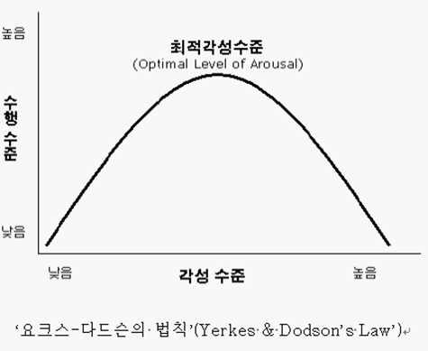
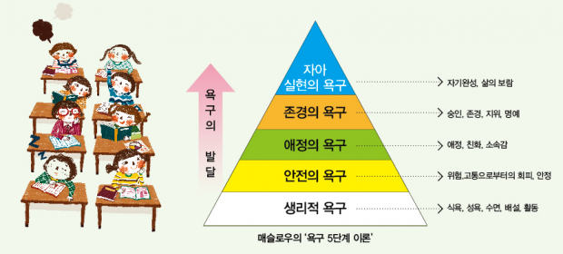

+++
author = "IceBlueHalls"
title = "심리학 강의 7강 - 동기"
date = "2023-04-15"
description = "심리학 강의 7강 - 동기"
tags = [
    "University",
    "Psychology"
]
categories = [
    "University"
]
series = ["Psychology"]
aliases = ["Psychology"]
slug = "psychology-7"
+++

# 동기

동기 : 목표를 향해 행동하도록 행동의 방향성을 제시하는 내외적 요소들의 집합

## 동기이론

### 추동감소이론
생리적 박탈이 생리적 욕구를 형성하고,  
욕구 미충족 시 생리적 추동을 느끼면서,   
이 추동 에너지가 욕구 해결 행동을 하면서 동기를 부여  

(목마름 > 물 필요 : 갈증 > 물 마시기)

> 예외, 맛과 다양성 추구는 결핍 없는 행동.

> 쥐에게 설탕물과 물을 주면 설탕물을 선택하고, 한개의 음식보다는 두개의 음식을 먹었을 때 30% 더 먹었다.

### 유인이론
외부환경 자극, 유인가가 행동의 동기(예시 : 돈, 좋은 성적, 인정, 버튼 쥐)

### 각성이론
행동은 최적의 각성 수준을 유지하는 것에 동기화.  
낮을 경우에는 노는 것을 통해 각성 수준을 올림(극단적으로는 놀이기구등의 익스트림 스포츠)  
높을 경우에는 쉬거나 잠을 자서 각성 수준을 저하.(과대 각성은 효율성 저하)

시험전에는 각성 > 긴장 상태  
공부는 쉬운 작업. 각성이 늦게 되고 빨리 사라짐  
발표는 어려운 작업. 각성이 쉽게 되고, 빨리 사라짐

## 심리적 동기 이론

### 매슬로의 욕구 위계 이론

자아실현의 욕구 :  
인간은 자기실현을 향해 성장하는 동물
하위욕구 충족 시 상위욕구를 충족하는 마음

자아실현의 욕구가 충족되기 위해서는 존경, 소속감과 사랑, 안전, 생리적 욕구가 충족 되어야한다.

### 자기 결정 이론
성장과 통합 과정을 돕는 선천적인 **기본 심리적 욕구**가 존재

**기본 심리적 욕구** : 

자율성
1. 미래는 내 자신이 결정
2. 내 생각과 의견 자유롭게 표현
3. 일 진행 방법은 스스로 결정

유능감 : 
- 내 자신이 유능
- 주변 사람은 내가 일을 잘한다고 생각
- 내가 하는 대부분에 일들에서 성취감

관계성 :
- 나와 관련된 사람과 잘 지냄
- 내 주변 사람들은 나에게 관심 있음
- 나는 함께하는 사람 좋아함

## 외재적 동기 & 내재적 동기
외재적 동기 : 보상 얻기 위해 행동(경제,명성,인정,이미지,외모)  
내제적 동기 : 나를 성장시키기 위해 행동  
(개인적 성장, 대인 관계, 사회 공헌, 건강)

과잉 정당화 : 외적동기 목적인데 보상이 없을 경우, 내제적 동기화된 행동이 감소  
(게임중독에게 외적 동기로 바꿔서 욕하면 줄어듬)

내재적 동기 충족 시 기본 심리적 욕구가 채워지면서 행복 & 번영이 된다.  
외제적도 가능하지만 내제적이 되기 위해 외제적을 개발하므로 돌아가는 방법이다.

## 학습목표 & 평가목표
**학습목표** : 도전, 노력, 도전적 과제, 과정의 즐거움을 강조하는 환경,  
**평가목표** : 포기, 좌절, 쉬운 과제, 점수 석차를 강조하는 환경, 지능 능력에 대한 칭찬
